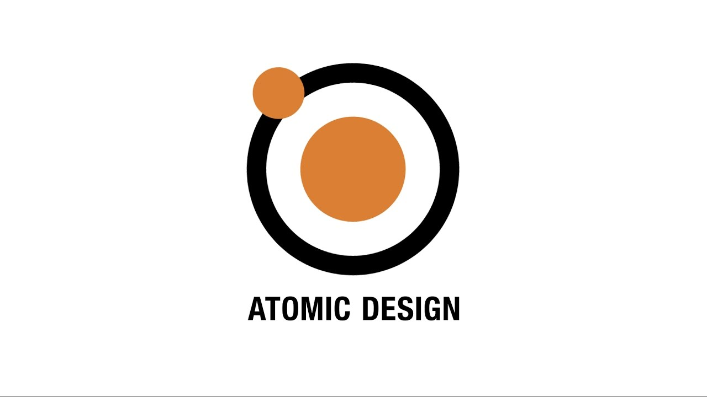

<h1 id="heading" align="center">Papillon Ads</h1>

  

  

    <a href="https://travis-ci.org/github/papillonads/papillonads">
      
      
    </a>
    <a href="https://codecov.io/gh/papillonads/papillonads">
      
      
    </a>
    
  

  

    
    
    
    
    
    
  

  

    
    
    
  

  

    
    
    
  

  

    
    
    
    
    
  

  

    
    
    
  

  

    
    
  

  

    
    
    
  

  

    
    
    
    
    
    
  

<h2 id="intro" style="color: #006400;">🗿 Introduction</h2>

<blockquote id="intro-quote" style="margin: 0; padding: 0 24px; color: olive; font-weight: 600; font-size:1em">🐝. Introduction to Papillon Ads.</blockquote>

<h2 id="packages" style="color: #006400;">🗿 Packages</h2>

<blockquote id="packages-quote" style="margin: 0; padding: 0 24px; color: olive; font-weight: 600; font-size:1em">🐝. Published packages.</blockquote> 

  
 📚 Components

  <blockquote style="margin: 0; padding: 0 24px">
    

      
📗 Primer

      <blockquote style="margin: 0; padding: 0 24px">
        

          
📖. Blankslate

          <blockquote style="margin: 0; padding: 0 24px">
            To be documented soon
          </blockquote>
        

        

          
📖. Box

          <blockquote style="margin: 0; padding: 0 24px">
            To be documented soon
          </blockquote>
        

        

          
📖. BranchName

          <blockquote style="margin: 0; padding: 0 24px">
            To be documented soon
          </blockquote>
        

        

          
📖. Breadcrumb

          <blockquote style="margin: 0; padding: 0 24px">
            🔖 <a style="color: #006400;" href="https://papillonads.github.io/papillonads/?path=/info/primer-atom-breadcrumb">Documentation</a> 
            🔖 <a style="color: #006400;" href="https://github.com/papillonads/papillonads/tree/master/packages/components/src/primer/Breadcrumb">Implementation</a> 
            🔖 <a style="color: #006400;" href="https://papillonads.github.io/papillonads/?path=/story/primer-atom-breadcrumb">Story</a> 
          </blockquote>
        

        

          
📖. Button

          <blockquote style="margin: 0; padding: 0 24px">
            🔖 <a style="color: #006400;" href="https://papillonads.github.io/papillonads/?path=/info/primer-atom-button">Documentation</a> 
            🔖 <a style="color: #006400;" href="https://github.com/papillonads/papillonads/tree/master/packages/components/src/primer/Button">Implementation</a> 
            🔖 <a style="color: #006400;" href="https://papillonads.github.io/papillonads/?path=/story/primer-atom-button">Story</a> 
          </blockquote>
        

        

          
📖. Concept

          <blockquote style="margin: 0; padding: 0 24px">
            To be documented soon
          </blockquote>
        

        

          
📖. Dropdown

          <blockquote style="margin: 0; padding: 0 24px">
            🔖 <a style="color: #006400;" href="https://papillonads.github.io/papillonads/?path=/info/primer-atom-dropdown">Documentation</a> 
            🔖 <a style="color: #006400;" href="https://github.com/papillonads/papillonads/tree/master/packages/components/src/primer/Dropdown">Implementation</a> 
            🔖 <a style="color: #006400;" href="https://papillonads.github.io/papillonads/?path=/story/primer-atom-dropdown">Story</a> 
          </blockquote>
        

        

          
📖. Form

          <blockquote style="margin: 0; padding: 0 24px">
            

              
📃. Checkbox

              <blockquote style="margin: 0; padding: 0 24px">
                🔖 <a style="color: #006400;" href="https://papillonads.github.io/papillonads/?path=/info/primer-atom-form-checkbox">Documentation</a> 
                🔖 <a style="color: #006400;" href="https://github.com/papillonads/papillonads/tree/master/packages/components/src/primer/Form/Checkbox">Implementation</a> 
                🔖 <a style="color: #006400;" href="https://papillonads.github.io/papillonads/?path=/story/primer-atom-form-checkbox">Story</a> 
              </blockquote>
            

            

              
📃. Input

              <blockquote style="margin: 0; padding: 0 24px">
                🔖 <a style="color: #006400;" href="https://papillonads.github.io/papillonads/?path=/info/primer-atom-form-input">Documentation</a> 
                🔖 <a style="color: #006400;" href="https://github.com/papillonads/papillonads/tree/master/packages/components/src/primer/Form/Input">Implementation</a> 
                🔖 <a style="color: #006400;" href="https://papillonads.github.io/papillonads/?path=/story/primer-atom-form-input">Story</a> 
              </blockquote>
            

            

              
📃. Radio

              <blockquote style="margin: 0; padding: 0 24px">
                🔖 <a style="color: #006400;" href="https://papillonads.github.io/papillonads/?path=/info/primer-atom-form-radio">Documentation</a> 
                🔖 <a style="color: #006400;" href="https://github.com/papillonads/papillonads/tree/master/packages/components/src/primer/Form/Radio">Implementation</a> 
                🔖 <a style="color: #006400;" href="https://papillonads.github.io/papillonads/?path=/story/primer-atom-form-radio">Story</a> 
              </blockquote>
            

          </blockquote>
        

        

          
📖. Grid

          <blockquote style="margin: 0; padding: 0 24px">
            

              
📃. DisplayTable

              <blockquote style="margin: 0; padding: 0 24px">
                🔖 <a style="color: #006400;" href="https://papillonads.github.io/papillonads/?path=/info/primer-atom-grid-displaytable">Documentation</a> 
                🔖 <a style="color: #006400;" href="https://github.com/papillonads/papillonads/tree/master/packages/components/src/primer/Grid/DisplayTable">Implementation</a> 
                🔖 <a style="color: #006400;" href="https://papillonads.github.io/papillonads/?path=/story/primer-atom-grid-displaytable">Story</a> 
              </blockquote>
            

            

              
📃. FlexGrid

              <blockquote style="margin: 0; padding: 0 24px">
                🔖 <a style="color: #006400;" href="https://papillonads.github.io/papillonads/?path=/info/primer-atom-grid-flexgrid">Documentation</a> 
                🔖 <a style="color: #006400;" href="https://github.com/papillonads/papillonads/tree/master/packages/components/src/primer/Grid/FlexGrid">Implementation</a> 
                🔖 <a style="color: #006400;" href="https://papillonads.github.io/papillonads/?path=/story/primer-atom-grid-flexgrid">Story</a> 
              </blockquote>
            

          </blockquote>
        

        

          
📖. Icon

          <blockquote style="margin: 0; padding: 0 24px">
            🔖 <a style="color: #006400;" href="https://papillonads.github.io/papillonads/?path=/info/primer-atom-icon">Documentation</a> 
            🔖 <a style="color: #006400;" href="https://github.com/papillonads/papillonads/tree/master/packages/components/src/primer/Icon">Implementation</a> 
            🔖 <a style="color: #006400;" href="https://papillonads.github.io/papillonads/?path=/story/primer-atom-icon">Story</a> 
          </blockquote>
        

        

          
📖. Label

          <blockquote style="margin: 0; padding: 0 24px">
            🔖 <a style="color: #006400;" href="https://papillonads.github.io/papillonads/?path=/info/primer-atom-label">Documentation</a> 
            🔖 <a style="color: #006400;" href="https://github.com/papillonads/papillonads/tree/master/packages/components/src/primer/Label">Implementation</a> 
            🔖 <a style="color: #006400;" href="https://papillonads.github.io/papillonads/?path=/story/primer-atom-label">Story</a> 
          </blockquote>
        

        

          
📖. Layout

          <blockquote style="margin: 0; padding: 0 24px">
            🔖 <a style="color: #006400;" href="https://papillonads.github.io/papillonads/?path=/info/primer-atom-layout">Documentation</a> 
            🔖 <a style="color: #006400;" href="https://github.com/papillonads/papillonads/tree/master/packages/components/src/primer/Layout">Implementation</a> 
            🔖 <a style="color: #006400;" href="https://papillonads.github.io/papillonads/?path=/story/primer-atom-layout">Story</a> 
          </blockquote>
        

        

          
📖. Loader

          <blockquote style="margin: 0; padding: 0 24px">
            To be documented soon
          </blockquote>
        

        

          
📖. Navigation

          <blockquote style="margin: 0; padding: 0 24px">
            

              
📃. Menu

              <blockquote style="margin: 0; padding: 0 24px">
                🔖 <a style="color: #006400;" href="https://papillonads.github.io/papillonads/?path=/info/primer-atom-navigation-menu">Documentation</a> 
                🔖 <a style="color: #006400;" href="https://github.com/papillonads/papillonads/tree/master/packages/components/src/primer/Navigation/Menu">Implementation</a> 
                🔖 <a style="color: #006400;" href="https://papillonads.github.io/papillonads/?path=/story/primer-atom-navigation-menu">Story</a> 
              </blockquote>
            

            

              
📃. TabNav

              <blockquote style="margin: 0; padding: 0 24px">
                🔖 <a style="color: #006400;" href="https://papillonads.github.io/papillonads/?path=/info/primer-atom-navigation-tabnav">Documentation</a> 
                🔖 <a style="color: #006400;" href="https://github.com/papillonads/papillonads/tree/master/packages/components/src/primer/Navigation/TabNav">Implementation</a> 
                🔖 <a style="color: #006400;" href="https://papillonads.github.io/papillonads/?path=/story/primer-atom-navigation-tabnav">Story</a> 
              </blockquote>
            

            

              
📃. UnderlineNav

              <blockquote style="margin: 0; padding: 0 24px">
                🔖 <a style="color: #006400;" href="https://papillonads.github.io/papillonads/?path=/info/primer-atom-navigation-underlinenav">Documentation</a> 
                🔖 <a style="color: #006400;" href="https://github.com/papillonads/papillonads/tree/master/packages/components/src/primer/Navigation/UnderlineNav">Implementation</a> 
                🔖 <a style="color: #006400;" href="https://papillonads.github.io/papillonads/?path=/story/primer-atom-navigation-underlinenav">Story</a> 
              </blockquote>
            

          </blockquote>
        

        

          
📖. Pagination

          <blockquote style="margin: 0; padding: 0 24px">
            To be documented soon
          </blockquote>
        

        

          
📖. Popover

          <blockquote style="margin: 0; padding: 0 24px">
            To be documented soon
          </blockquote>
        

        

          
📖. Progress

          <blockquote style="margin: 0; padding: 0 24px">
            To be documented soon
          </blockquote>
        

        

          
📖. SelectMenu

          <blockquote style="margin: 0; padding: 0 24px">
            To be documented soon
          </blockquote>
        

        

          
📖. Subhead

          <blockquote style="margin: 0; padding: 0 24px">
            🔖 <a style="color: #006400;" href="https://papillonads.github.io/papillonads/?path=/info/primer-atom-subhead">Documentation</a> 
            🔖 <a style="color: #006400;" href="https://github.com/papillonads/papillonads/tree/master/packages/components/src/primer/Subhead">Implementation</a> 
            🔖 <a style="color: #006400;" href="https://papillonads.github.io/papillonads/?path=/story/primer-atom-subhead">Story</a> 
          </blockquote>
        

        

          
📖. Toast

          <blockquote style="margin: 0; padding: 0 24px">
            To be documented soon
          </blockquote>
        

      </blockquote>
    

  </blockquote>

  
 📚 CSS

  <blockquote style="margin: 0; padding: 0 24px">
    

      
📗 Primer

      <blockquote style="margin: 0; padding: 0 24px">
        

          
📖. Base

          <blockquote style="margin: 0; padding: 0 24px">
            

              
📃. Base

              <blockquote style="margin: 0; padding: 0 24px">
                🔖 <a style="color: #006400;" href="https://github.com/papillonads/papillonads/blob/master/packages/css/src/primer/base/base.scss">Implementation</a> 
              </blockquote>
            

            

              
📃. Keyboard Shortcuts

              <blockquote style="margin: 0; padding: 0 24px">
                🔖 <a style="color: #006400;" href="https://github.com/papillonads/papillonads/blob/master/packages/css/src/primer/base/kbd.scss">Implementation</a> 
              </blockquote>
            

            

              
📃. Normalize

              <blockquote style="margin: 0; padding: 0 24px">
                🔖 <a style="color: #006400;" href="https://github.com/papillonads/papillonads/blob/master/packages/css/src/primer/base/normalize.scss">Implementation</a> 
              </blockquote>
            

            

              
📃. Typography Base

              <blockquote style="margin: 0; padding: 0 24px">
                🔖 <a style="color: #006400;" href="https://github.com/papillonads/papillonads/blob/master/packages/css/src/primer/base/typography-base.scss">Implementation</a> 
              </blockquote>
            

          </blockquote>
        

        

          
📖. Support

          <blockquote style="margin: 0; padding: 0 24px">
            

              
📃. Mixins

              <blockquote style="margin: 0; padding: 0 24px">
                

                  
📄 Buttons

                  <blockquote style="margin: 0; padding: 0 24px">
                    🔖 <a style="color: #006400;" href="https://github.com/papillonads/papillonads/blob/master/packages/css/src/primer/support/mixins/buttons.scss">Implementation</a> 
                  </blockquote>
                

                

                  
📄 Layout

                  <blockquote style="margin: 0; padding: 0 24px">
                    🔖 <a style="color: #006400;" href="https://github.com/papillonads/papillonads/blob/master/packages/css/src/primer/support/mixins/layout.scss">Implementation</a> 
                  </blockquote>
                

                

                  
📄 Miscellaneous

                  <blockquote style="margin: 0; padding: 0 24px">
                    🔖 <a style="color: #006400;" href="https://github.com/papillonads/papillonads/blob/master/packages/css/src/primer/support/mixins/misc.scss">Implementation</a> 
                  </blockquote>
                

                

                  
📄 Typography

                  <blockquote style="margin: 0; padding: 0 24px">
                    🔖 <a style="color: #006400;" href="https://github.com/papillonads/papillonads/blob/master/packages/css/src/primer/support/mixins/typography.scss">Implementation</a> 
                  </blockquote>
                

              </blockquote>
            

            

              
📃. Variables

              <blockquote style="margin: 0; padding: 0 24px">
                

                  
📄 Color System

                  <blockquote style="margin: 0; padding: 0 24px">
                    🔖 <a style="color: #006400;" href="https://github.com/papillonads/papillonads/blob/master/packages/css/src/primer/support/variables/color-system.scss">Implementation</a> 
                  </blockquote>
                

                

                  
📄 Colors

                  <blockquote style="margin: 0; padding: 0 24px">
                    🔖 <a style="color: #006400;" href="https://github.com/papillonads/papillonads/blob/master/packages/css/src/primer/support/variables/colors.scss">Implementation</a> 
                  </blockquote>
                

                

                  
📄 Layout

                  <blockquote style="margin: 0; padding: 0 24px">
                    🔖 <a style="color: #006400;" href="https://github.com/papillonads/papillonads/blob/master/packages/css/src/primer/support/variables/layout.scss">Implementation</a> 
                  </blockquote>
                

                

                  
📄 Miscellaneous

                  <blockquote style="margin: 0; padding: 0 24px">
                    🔖 <a style="color: #006400;" href="https://github.com/papillonads/papillonads/blob/master/packages/css/src/primer/support/variables/misc.scss">Implementation</a> 
                  </blockquote>
                

                

                  
📄 Typography

                  <blockquote style="margin: 0; padding: 0 24px">
                    🔖 <a style="color: #006400;" href="https://github.com/papillonads/papillonads/blob/master/packages/css/src/primer/support/variables/typography.scss">Implementation</a> 
                  </blockquote>
                

              </blockquote>
            

          </blockquote>
        

        

          
📖. Utilities

          <blockquote style="margin: 0; padding: 0 24px">
            

              
📃. Animations

              <blockquote style="margin: 0; padding: 0 24px">
                🔖 <a style="color: #006400;" href="https://github.com/papillonads/papillonads/blob/master/packages/css/src/primer/utilities/animations.scss">Implementation</a> 
              </blockquote>
            

            

              
📃. Borders

              <blockquote style="margin: 0; padding: 0 24px">
                🔖 <a style="color: #006400;" href="https://github.com/papillonads/papillonads/blob/master/packages/css/src/primer/utilities/borders.scss">Implementation</a> 
              </blockquote>
            

            

              
📃. Box Shadows

              <blockquote style="margin: 0; padding: 0 24px">
                🔖 <a style="color: #006400;" href="https://github.com/papillonads/papillonads/blob/master/packages/css/src/primer/utilities/box-shadow.scss">Implementation</a> 
              </blockquote>
            

            

              
📃. Colors

              <blockquote style="margin: 0; padding: 0 24px">
                🔖 <a style="color: #006400;" href="https://github.com/papillonads/papillonads/blob/master/packages/css/src/primer/utilities/colors.scss">Implementation</a> 
              </blockquote>
            

            

              
📃. Details

              <blockquote style="margin: 0; padding: 0 24px">
                🔖 <a style="color: #006400;" href="https://github.com/papillonads/papillonads/blob/master/packages/css/src/primer/utilities/details.scss">Implementation</a> 
              </blockquote>
            

            

              
📃. Flexbox

              <blockquote style="margin: 0; padding: 0 24px">
                🔖 <a style="color: #006400;" href="https://github.com/papillonads/papillonads/blob/master/packages/css/src/primer/utilities/flexbox.scss">Implementation</a> 
              </blockquote>
            

            

              
📃. Layout

              <blockquote style="margin: 0; padding: 0 24px">
                🔖 <a style="color: #006400;" href="https://github.com/papillonads/papillonads/blob/master/packages/css/src/primer/utilities/layout.scss">Implementation</a> 
              </blockquote>
            

            

              
📃. Margin

              <blockquote style="margin: 0; padding: 0 24px">
                🔖 <a style="color: #006400;" href="https://github.com/papillonads/papillonads/blob/master/packages/css/src/primer/utilities/margin.scss">Implementation</a> 
              </blockquote>
            

            

              
📃. Padding

              <blockquote style="margin: 0; padding: 0 24px">
                🔖 <a style="color: #006400;" href="https://github.com/papillonads/papillonads/blob/master/packages/css/src/primer/utilities/padding.scss">Implementation</a> 
              </blockquote>
            

            

              
📃. Typography

              <blockquote style="margin: 0; padding: 0 24px">
                🔖 <a style="color: #006400;" href="https://github.com/papillonads/papillonads/blob/master/packages/css/src/primer/utilities/typography.scss">Implementation</a> 
              </blockquote>
            

            

              
📃. Visibility Display

              <blockquote style="margin: 0; padding: 0 24px">
                🔖 <a style="color: #006400;" href="https://github.com/papillonads/papillonads/blob/master/packages/css/src/primer/utilities/visibility-display.scss">Implementation</a> 
              </blockquote>
            

          </blockquote>
        

      </blockquote>
    

  </blockquote>

  
 📚 Docs

  <blockquote style="margin: 0; padding: 0 24px">
    To be documented soon
  </blockquote>

  
 📚 Library

  <blockquote style="margin: 0; padding: 0 24px">
    

      
📗 Accessibility

      <blockquote style="margin: 0; padding: 0 24px">
        

          
📖. Check

          <blockquote style="margin: 0; padding: 0 24px">
            🔖 <a style="color: #006400;" href="https://github.com/papillonads/papillonads/blob/master/packages/library/src/a11y/check.js">Implementation</a> 
          </blockquote>
        

      </blockquote>
    

    

      
📗 Browser

      <blockquote style="margin: 0; padding: 0 24px">
        

          
📖. Browser

          <blockquote style="margin: 0; padding: 0 24px">
            🔖 <a style="color: #006400;" href="https://github.com/papillonads/papillonads/blob/master/packages/library/src/browser/isBrowser.js">Implementation</a> 
          </blockquote>
        

      </blockquote>
    

    

      
📗 Environment

      <blockquote style="margin: 0; padding: 0 24px">
        

          
📖. API

          <blockquote style="margin: 0; padding: 0 24px">
            🔖 <a style="color: #006400;" href="https://github.com/papillonads/papillonads/blob/master/packages/library/src/environment/api.js">Implementation</a> 
          </blockquote>
        

        

          
📖. Host

          <blockquote style="margin: 0; padding: 0 24px">
            🔖 <a style="color: #006400;" href="https://github.com/papillonads/papillonads/blob/master/packages/library/src/environment/host.js">Implementation</a> 
          </blockquote>
        

      </blockquote>
    

    

      
📗 Hooks

      <blockquote style="margin: 0; padding: 0 24px">
        

          
📖. React

          <blockquote style="margin: 0; padding: 0 24px">
            🔖 <a style="color: #006400;" href="https://github.com/papillonads/papillonads/blob/master/packages/library/src/hooks/react.js">Implementation</a> 
          </blockquote>
        

      </blockquote>
    

    

      
📗 Navigation

      <blockquote style="margin: 0; padding: 0 24px">
        

          
📖. Item

          <blockquote style="margin: 0; padding: 0 24px">
            🔖 <a style="color: #006400;" href="https://github.com/papillonads/papillonads/blob/master/packages/library/src/navigation/item.js">Implementation</a> 
          </blockquote>
        

      </blockquote>
    

    

      
📗 Object

      <blockquote style="margin: 0; padding: 0 24px">
        

          
📖. Clone

          <blockquote style="margin: 0; padding: 0 24px">
            🔖 <a style="color: #006400;" href="https://github.com/papillonads/papillonads/blob/master/packages/library/src/object/clone.js">Implementation</a> 
          </blockquote>
        

      </blockquote>
    

    

      
📗 State

      <blockquote style="margin: 0; padding: 0 24px">
        

          
📖. Default

          <blockquote style="margin: 0; padding: 0 24px">
            

              
📃. Context

              <blockquote style="margin: 0; padding: 0 24px">
                🔖 <a style="color: #006400;" href="https://github.com/papillonads/papillonads/tree/master/packages/library/src/state/default/context">Implementation</a> 
              </blockquote>
            

            

              
📃. API

              <blockquote style="margin: 0; padding: 0 24px">
                To be documented soon
              </blockquote>
            

            

              
📃. UI

              <blockquote style="margin: 0; padding: 0 24px">
                🔖 <a style="color: #006400;" href="https://github.com/papillonads/papillonads/tree/master/packages/library/src/state/default/ui">Implementation</a> 
              </blockquote>
            

          </blockquote>
        

        

          
📖. Mock

          <blockquote style="margin: 0; padding: 0 24px">
            

              
📃. Context

              <blockquote style="margin: 0; padding: 0 24px">
                🔖 <a style="color: #006400;" href="https://github.com/papillonads/papillonads/tree/master/packages/library/src/state/mock/context">Implementation</a> 
              </blockquote>
            

            

              
📃. API

              <blockquote style="margin: 0; padding: 0 24px">
                To be documented soon
              </blockquote>
            

            

              
📃. UI

              <blockquote style="margin: 0; padding: 0 24px">
                🔖 <a style="color: #006400;" href="https://github.com/papillonads/papillonads/tree/master/packages/library/src/state/mock/ui">Implementation</a> 
              </blockquote>
            

          </blockquote>
        

      </blockquote>
    

    

      
📗 Store

      <blockquote style="margin: 0; padding: 0 24px">
        

          
📖. Mock

          <blockquote style="margin: 0; padding: 0 24px">
            🔖 <a style="color: #006400;" href="https://github.com/papillonads/papillonads/tree/master/packages/library/src/store/mock">Implementation</a> 
          </blockquote>
        

      </blockquote>
    

  </blockquote>

  
 📚 Styleguide

  <blockquote style="margin: 0; padding: 0 24px">
    To be documented soon
  </blockquote>

<h2 id="concepts" style="color: #006400;">🗿 Concepts</h2>

<blockquote id="concepts-quote" style="margin: 0; padding: 0 24px; color: olive; font-weight: 600; font-size:1em">🐝. Applied concepts.</blockquote> 

  
 📚 Accessibility

  <blockquote style="margin: 0; padding: 0 24px">
    

      
📗 Specifications/Standards/Guidelines

      <blockquote style="margin: 0; padding: 0 24px">
        

          
📖. MDN

          <blockquote style="margin: 0; padding: 0 24px">
            

              
📃. <a style="color: #006400;" href="https://developer.mozilla.org/en-US/docs/Web/Accessibility">Web technology for developers » Accessibility</a>

              <blockquote style="margin: 0; padding: 0 24px">
                🔖 Accessibility (often abbreviated to A11y—as in "a" then 11 characters then "y") in Web development means enabling as many people as possible to use Web sites, even when those people's abilities are limited in some way. 
                🔖 For many people, technology makes things easier. For people with disabilities, technology makes things possible. Accessibility means developing content to be as accessible as possible no matter an individual's physical and cognitive abilities and no matter how they access the web. 
                🔖 "The Web is fundamentally designed to work for all people, whatever their hardware, software, language, culture, location, or physical or mental ability. When the Web meets this goal, it is accessible to people with a diverse range of hearing, movement, sight, and cognitive ability." 
              </blockquote>
            

          </blockquote>
        

        

          
📖. Web Accessibility Initiative (WAI)

          <blockquote style="margin: 0; padding: 0 24px">
            

              
📃. <a style="color: #006400;" href="https://www.w3.org/WAI/standards-guidelines/wcag/">Web Content Accessibility Guidelines (WCAG) Overview</a>

              <blockquote style="margin: 0; padding: 0 24px">
                🔖 Web Content Accessibility Guidelines (WCAG) is developed through the W3C process in cooperation with individuals and organizations around the world, with a goal of providing a single shared standard for web content accessibility that meets the needs of individuals, organizations, and governments internationally. 
              </blockquote>
            

          </blockquote>
        

        

          
📖. World Wide Web Consortium (W3C)

          <blockquote style="margin: 0; padding: 0 24px">
            

              
📃. <a style="color: #006400;" href="https://www.w3.org/standards/webdesign/accessibility">W3C » Standards » Web Design and Applications » Accessibility</a>

              <blockquote style="margin: 0; padding: 0 24px">
                🔖 The Web is fundamentally designed to work for all people, whatever their hardware, software, language, location, or ability. When the Web meets this goal, it is accessible to people with a diverse range of hearing, movement, sight, and cognitive ability. 
                🔖 Thus the impact of disability is radically changed on the Web because the Web removes barriers to communication and interaction that many people face in the physical world. However, when web sites, applications, technologies, or tools are badly designed, they can create barriers that exclude people from using the Web. 
                🔖 Accessibility is essential for developers and organizations that want to create high quality websites and web tools, and not exclude people from using their products and services. 
                🔖 The mission of the Web Accessibility Initiative (WAI) is to lead the Web to its full potential to be accessible, enabling people with disabilities to participate equally on the Web. 
              </blockquote>
            

          </blockquote>
        

        

          
📖. React.JS

          <blockquote style="margin: 0; padding: 0 24px">
            

              
📃. <a style="color: #006400;" href="https://reactjs.org/docs/accessibility.html">Accessibility</a>

              <blockquote style="margin: 0; padding: 0 24px">
                🔖 Web accessibility (also referred to as a11y) is the design and creation of websites that can be used by everyone. Accessibility support is necessary to allow assistive technology to interpret web pages. 
                🔖 React fully supports building accessible websites, often by using standard HTML techniques. 
              </blockquote>
            

          </blockquote>
        

      </blockquote>
    

    

      
📗 Open Source Dependency Projects

      <blockquote style="margin: 0; padding: 0 24px">
        

          
📖. Axe Core

          <blockquote style="margin: 0; padding: 0 24px">
            

              
📃. <a style="color: #006400;" href="https://github.com/dequelabs/axe-core">Accessibility engine for automated Web UI testing</a>

              <blockquote style="margin: 0; padding: 0 24px">
                🔖 Axe is an accessibility testing engine for websites and other HTML-based user interfaces. It's fast, secure, lightweight, and was built to seamlessly integrate with any existing test environment so you can automate accessibility testing alongside your regular functional testing. 
              </blockquote>
            

            

              
📃. <a style="color: #006400;" href="https://www.deque.com/axe/">Axe: Accessibility for Development Teams</a>

              <blockquote style="margin: 0; padding: 0 24px">
                🔖 Axe is the World’s most popular accessibility testing toolkit built on the World’s most popular accessibility rules library. Axe is ideal for development teams to test their Web or Android applications to help identify and resolve common accessibility issues. Built to scale with your needs, users have run axe for everything from ad-hoc single page tests to testing hundreds of thousands of pages while integrated into existing CI/CD processes. It’s simple to use, doesn’t require advanced accessibility knowledge and won’t waste your time with false positives. 
              </blockquote>
            

          </blockquote>
        

        

          
📖. @axe-core/react

          <blockquote style="margin: 0; padding: 0 24px">
          

            
📃. <a style="color: #006400;" href="https://github.com/dequelabs/axe-core-npm/tree/develop/packages/react">Accessibility auditing for React.js applications</a>

            <blockquote style="margin: 0; padding: 0 24px">
              🔖 Test your React application with the axe-core accessibility testing library. Results will show in the Chrome DevTools console. 
            </blockquote>
          

          </blockquote>
        

        

          
📖. Storybook

          <blockquote style="margin: 0; padding: 0 24px">
            

              
📃. <a style="color: #006400;" href="https://github.com/storybookjs/storybook/tree/next/addons/a11y">@storybook/addon-a11y</a>

              <blockquote style="margin: 0; padding: 0 24px">
                🔖 This storybook addon can be helpful to make your UI components more accessible. 
              </blockquote>
            

          </blockquote>
        

        

          
📖. ESLint

          <blockquote style="margin: 0; padding: 0 24px">
            

              
📃. <a style="color: #006400;" href="https://github.com/evcohen/eslint-plugin-jsx-a11y">eslint-plugin-jsx-a11y</a>

              <blockquote style="margin: 0; padding: 0 24px">
                🔖 Static AST checker for accessibility rules on JSX elements. 
                🔖 Ryan Florence built out this awesome runtime-analysis tool called react-a11y. It is super useful. However, since you're probably already using linting in your project, this plugin comes for free and closer to the actual development process. Pairing this plugin with an editor lint plugin, you can bake accessibility standards into your application in real-time. 
                🔖 Note: This project does not replace react-a11y, but can and should be used in conjunction with it. Static analysis tools cannot determine values of variables that are being placed in props before runtime, so linting will not fail if that value is undefined and/or does not pass the lint rule. 
              </blockquote>
            

          </blockquote>
        

      </blockquote>
    

    

      
📗 Papillon Ads Implementation

      <blockquote style="margin: 0; padding: 0 24px">
        

          
📖. Papillon Ads

          <blockquote style="margin: 0; padding: 0 24px">
            

              
📃. Setup file(s)

              <blockquote style="margin: 0; padding: 0 24px">
              

                
🔖 <a style="color: #006400;" href="https://github.com/papillonads/papillonads/blob/master/package.json">package.json</a>

                <blockquote style="margin: 0; padding: 0 24px">
                  ✎ Installs <a style="color: #006400;" href="https://github.com/evcohen/eslint-plugin-jsx-a11y">eslint-plugin-jsx-a11y</a> and 
                  <a style="color: #006400;" href="https://github.com/storybookjs/storybook/tree/next/addons/a11y">@storybook/addon-a11y</a> as devDependencies
                </blockquote>
              

              

                
🔖 <a style="color: #006400;" href="https://github.com/papillonads/papillonads/blob/master/.eslintrc">.eslintrc</a>

                <blockquote style="margin: 0; padding: 0 24px">
                  ✎ Lets ESLint make use of <a style="color: #006400;" href="https://github.com/evcohen/eslint-plugin-jsx-a11y">eslint-plugin-jsx-a11y</a>
                </blockquote>
              

              

                
🔖 <a style="color: #006400;" href="https://github.com/papillonads/papillonads/blob/master/.storybook/main.js">.storybook/main.js</a>

                <blockquote style="margin: 0; padding: 0 24px">
                  ✎ Lets Storybook make use of <a style="color: #006400;" href="https://github.com/storybookjs/storybook/tree/next/addons/a11y">@storybook/addon-a11y</a>
                </blockquote>
              

              

                
🔖 <a style="color: #006400;" href="https://github.com/papillonads/papillonads/blob/master/.storybook/preview.js">.storybook/preview.js</a>

                <blockquote style="margin: 0; padding: 0 24px">
                  ✎ Lets Storybook make use of <a style="color: #006400;" href="https://github.com/storybookjs/storybook/blob/next/addons/a11y/src/index.ts#L98">withA11y</a> decorator
                </blockquote>
              

              </blockquote>
            

            

              
📃. Knowledge base

              <blockquote style="margin: 0; padding: 0 24px">
                To be documented soon
              </blockquote>
            

          </blockquote>
        

        

          
📖. Microsites

          <blockquote style="margin: 0; padding: 0 24px">
            

              
📃. Setup file(s)

              <blockquote style="margin: 0; padding: 0 24px">
                To be documented soon
              </blockquote>
            

            

              
📃. Knowledge base

              <blockquote style="margin: 0; padding: 0 24px">
                To be documented soon
              </blockquote>
            

          </blockquote>
        

      </blockquote>
    

  </blockquote>

  
 📚 Application Architecture

  <blockquote style="margin: 0; padding: 0 24px">
    

      
📗 Specifications/Standards/Guidelines

      <blockquote style="margin: 0; padding: 0 24px">
        

          
📖. Redux

          <blockquote style="margin: 0; padding: 0 24px">
            

              
📃. <a style="color: #006400;" href="https://redux.js.org/">A Predictable State Container for JS Apps</a>

              <blockquote style="margin: 0; padding: 0 24px">
                🔖 Redux is a predictable state container for JavaScript apps. 
                🔖 It helps you write applications that behave consistently, run in different environments (client, server, and native), and are easy to test. On top of that, it provides a great developer experience, such as live code editing combined with a time traveling debugger. 
                🔖 You can use Redux together with React, or with any other view library. It is tiny (2kB, including dependencies), but has a large ecosystem of addons available. 
              </blockquote>
            

            

              
📃. <a style="color: #006400;" href="https://redux.js.org/style-guide/style-guide/">Redux Style Guide</a>

              <blockquote style="margin: 0; padding: 0 24px">
                🔖 This is the official style guide for writing Redux code. It lists our recommended patterns, best practices, and suggested approaches for writing Redux applications. 
                🔖 Both the Redux core library and most of the Redux documentation are unopinionated. There are many ways to use Redux, and much of the time there is no single "right" way to do things. 
                🔖 However, time and experience have shown that for some topics, certain approaches work better than others. In addition, many developers have asked us to provide official guidance to reduce decision fatigue. 
                🔖 With that in mind, we've put together this list of recommendations to help you avoid errors, bikeshedding, and anti-patterns. We also understand that team preferences vary and different projects have different requirements, so no style guide will fit all sizes. You are encouraged to follow these recommendations, but take the time to evaluate your own situation and decide if they fit your needs. 
              </blockquote>
            

          </blockquote>
        

        

          
📖. Flux

          <blockquote style="margin: 0; padding: 0 24px">
            

              
📃. <a style="color: #006400;" href="https://facebook.github.io/flux/">Application architecture for building user interfaces</a>

              <blockquote style="margin: 0; padding: 0 24px">
                🔖 These are the important high-level concepts and principles you should know about when writing applications that use Flux. 
                🔖 Flux is a pattern for managing data flow in your application. The most important concept is that data flows in one direction. As we go through this guide we'll talk about the different pieces of a Flux application and show how they form unidirectional cycles that data can flow through. 
                🔖 These are the important high-level <a style="color: #006400;" href="https://github.com/facebook/flux/tree/master/examples/flux-concepts">concepts</a> and principles you should know about when writing applications that use Flux. 
              </blockquote>
            

          </blockquote>
        

      </blockquote>
    

    

      
📗 Open Source Dependency Projects

      <blockquote style="margin: 0; padding: 0 24px">
        

          
📖. Redux

          <blockquote style="margin: 0; padding: 0 24px">
            

              
📃. <a style="color: #006400;" href="https://github.com/reduxjs/redux">Predictable state container for JavaScript apps</a>

              <blockquote style="margin: 0; padding: 0 24px">
                🔖 Redux is a predictable state container for JavaScript apps. (Not to be confused with a WordPress framework – Redux Framework.) 
                🔖 It helps you write applications that behave consistently, run in different environments (client, server, and native), and are easy to test. On top of that, it provides a great developer experience, such as live code editing combined with a time traveling debugger. 
                🔖 You can use Redux together with React, or with any other view library. It is tiny (2kB, including dependencies). 
              </blockquote>
            

            

              
📃. <a style="color: #006400;" href="https://github.com/reduxjs/react-redux">Official React bindings for Redux</a>

              <blockquote style="margin: 0; padding: 0 24px">
                🔖 React Redux is the official React binding for Redux. It lets your React components read data from a Redux store, and dispatch actions to the store to update data. 
                🔖 React Redux provides <Provider />, which makes the Redux store available to the rest of your app: 
                🔖 React Redux provides a connect function for you to connect your component to the store. 
              </blockquote>
            

            

              
📃. <a style="color: #006400;" href="https://github.com/reduxjs/redux-thunk">Thunk middleware for Redux</a>

              <blockquote style="margin: 0; padding: 0 24px">
                🔖 With a plain basic Redux store, you can only do simple synchronous updates by dispatching an action. Middleware extend the store's abilities, and let you write async logic that interacts with the store. 
                🔖 Thunks are the recommended middleware for basic Redux side effects logic, including complex synchronous logic that needs access to the store, and simple async logic like AJAX requests. 
                🔖 Redux Thunk middleware allows you to write action creators that return a function instead of an action. The thunk can be used to delay the dispatch of an action, or to dispatch only if a certain condition is met. The inner function receives the store methods dispatch and getState as parameters. 
                🔖 An action creator that returns a function to perform asynchronous dispatch 
                🔖 A thunk is a function that wraps an expression to delay its evaluation. 
                🔖 Any return value from the inner function will be available as the return value of dispatch itself. This is convenient for orchestrating an asynchronous control flow with thunk action creators dispatching each other and returning Promises to wait for each other’s completion. 
                🔖 Since 2.1.0, Redux Thunk supports injecting a custom argument using the withExtraArgument function. 
              </blockquote>
            

            

              
📃. <a style="color: #006400;" href="https://github.com/LogRocket/redux-logger">Logger for Redux</a>

              <blockquote style="margin: 0; padding: 0 24px">
                🔖 You can create your own logger with following custom options: 
                🔖 <strong>predicate:</strong> If specified this function will be called before each action is processed with this middleware. 
                🔖 <strong>collapsed:</strong> Takes a Boolean or optionally a Function that receives `getState` function for accessing current store state and `action` object as parameters. Returns `true` if the log group should be collapsed, `false` otherwise. 
                🔖 <strong>duration = false: Boolean:</strong> Print the duration of each action? 
                🔖 <strong>timestamp = true: Boolean:</strong> Print the timestamp with each action? 
                🔖 <strong>level = 'log':</strong> 'log' | 'console' | 'warn' | 'error' | 'info': console's level 
                🔖 <strong>colors: ColorsObject:</strong> <a style="color: #006400;" href="https://github.com/LogRocket/redux-logger/blob/master/src/defaults.js#L12-L18">Colors</a> for title, prev state, action and next state 
                🔖 <strong>titleFormatter:</strong> Format the title used when logging actions. 
                🔖 <strong>stateTransformer:</strong> Transform state before print. Eg. convert Immutable object to plain JSON. 
                🔖 <strong>actionTransformer:</strong> Transform action before print. Eg. convert Immutable object to plain JSON. 
                🔖 <strong>errorTransformer:</strong> Transform error before print. Eg. convert Immutable object to plain JSON. 
                🔖 <strong>logger = console: LoggerObject:</strong> Implementation of the `console` API. 
                🔖 <strong>logErrors = true: Boolean:</strong> should the logger catch, log, and re-throw errors? 
                🔖 <strong>diff = false: Boolean:</strong> (alpha) Show diff between states? 
                🔖 <strong>diffPredicate:</strong> (alpha) Filter function for showing states diff, similar to `predicate` 
              </blockquote>
            

            

              
📃. <a style="color: #006400;" href="https://github.com/dmitry-zaets/redux-mock-store">A mock store for testing Redux async action creators and middleware</a>

              <blockquote style="margin: 0; padding: 0 24px">
                🔖 A mock store for testing Redux async action creators and middleware. The mock store will create an array of dispatched actions which serve as an action log for tests. 
                🔖 Please note that this library is designed to test the action-related logic, not the reducer-related one. In other words, it does not update the Redux store. If you want a complex test combining actions and reducers together, take a look at other libraries (e.g., redux-actions-assertions). Refer to issue #71 for more details. 
                🔖 <strong>Synchronous actions:</strong> The simplest usecase is for synchronous actions. In this example, we will test if the addTodo action returns the right payload. redux-mock-store saves all the dispatched actions inside the store instance. You can get all the actions by calling store.getActions(). Finally, you can use any assertion library to test the payload. 
                🔖 <strong>Asynchronous actions</strong> A common usecase for an asynchronous action is a HTTP request to a server. In order to test those types of actions, you will need to call store.getActions() at the end of the request. 
              </blockquote>
            

          </blockquote>
        

      </blockquote>
    

    

      
📗 Papillon Ads Implementation

      <blockquote style="margin: 0; padding: 0 24px">
        

          
📖. Papillon Ads

          <blockquote style="margin: 0; padding: 0 24px">
            

              
📃. Setup file(s)

              <blockquote style="margin: 0; padding: 0 24px">
                To be documented soon 
              </blockquote>
            

            

              
📃. Knowledge base

              <blockquote style="margin: 0; padding: 0 24px">
                To be documented soon
              </blockquote>
            

          </blockquote>
        

        

          
📖. Microsites

          <blockquote style="margin: 0; padding: 0 24px">
            

              
📃. Setup file(s)

              <blockquote style="margin: 0; padding: 0 24px">
                ✎ <a style="color: #006400;" href="https://github.com/papillonads/marketplace/blob/master/package.json">package.json</a> 
                ✎ <a style="color: #006400;" href="https://github.com/papillonads/marketplace/blob/master/packages/core/src/store/client.js">store/client.js</a> 
                ✎ <a style="color: #006400;" href="https://github.com/papillonads/marketplace/blob/master/packages/core/src/store/base.js">store/base.js</a> 
              </blockquote>
            

            

              
📃. Knowledge base

              <blockquote style="margin: 0; padding: 0 24px">
                To be documented soon
              </blockquote>
            

          </blockquote>
        

      </blockquote>
    

  </blockquote>

  
 📚 Bootstrap

  <blockquote style="margin: 0; padding: 0 24px">
    

      
📗 Specifications/Standards/Guidelines

      <blockquote style="margin: 0; padding: 0 24px">
        To be documented soon
      </blockquote>
    

    

      
📗 Open Source Dependency Projects

      <blockquote style="margin: 0; padding: 0 24px">
        To be documented soon
      </blockquote>
    

    

      
📗 Papillon Ads Implementation

      <blockquote style="margin: 0; padding: 0 24px">
        

          
📖. Papillon Ads

          <blockquote style="margin: 0; padding: 0 24px">
            To be documented soon
          </blockquote>
        

        

          
📖. Microsites

          <blockquote style="margin: 0; padding: 0 24px">
            

              
📃. Install

              <blockquote style="margin: 0; padding: 0 24px">
                ✎ Run <kbd>rm -rf node_modules package-lock.json && npm install</kbd> for <kbd>repository root</kbd> and <kbd>packages/core</kbd> folder to remove node_modules directory, package-lock.json file and install all packages from scratch 
              </blockquote>
            

            

              
📃. Bootstrap

              <blockquote style="margin: 0; padding: 0 24px">
                ✎ Run <kbd>npm run bootstrap</kbd>to run linting, formatting, testing and building sequentially 
              </blockquote>
            

            

              
📃. Start

              <blockquote style="margin: 0; padding: 0 24px">
                ✎ Run <kbd>npm start</kbd> in 1nd terminal in packages/core to start up webpack-dev-server 
                ✎ Run <kbd>npm run test -- --watch --onlyChanged --verbose</kbd> in 2rd terminal to let Jest watch changed tests 
              </blockquote>
            

            

              
📃. Dynamic Code Splitting

              <blockquote style="margin: 0; padding: 0 24px">
                ✎ Babel enables parsing dynamic imports through <a style="color: #006400;" href="https://babeljs.io/docs/en/babel-plugin-syntax-dynamic-import">@babel/plugin-syntax-dynamic-import</a> since <a style="color: #006400;" href="https://babeljs.io/blog/2019/07/03/7.5.0">v7.5.0</a> 
                ✎ Webpack recommends this <a style="color: #006400;" href="https://webpack.js.org/guides/code-splitting/#dynamic-imports">technique</a> instead of the legacy webpack-specific approach through optimization.splitChunks configuration option. 
              </blockquote>
            

          </blockquote>
        

      </blockquote>
    

  </blockquote>

  
 📚 Code Style

  <blockquote style="margin: 0; padding: 0 24px">
    

      
📗 Specifications/Standards/Guidelines

      <blockquote style="margin: 0; padding: 0 24px">
        

          
📖. Code Linting

          <blockquote style="margin: 0; padding: 0 24px">
            

              
📃. JavaScript

              <blockquote style="margin: 0; padding: 0 24px">
                

                  
📄 <a style="color: #006400;" href="https://github.com/airbnb/javascript">AirBnb JavaScript Style Guide</a>

                  <blockquote style="margin: 0; padding: 0 24px">
                    🔖 A mostly reasonable approach to JavaScript 
                    🔖 Note: this guide assumes you are using Babel, and requires that you use babel-preset-airbnb or the equivalent. It also assumes you are installing shims/polyfills in your app, with airbnb-browser-shims or the equivalent. 
                  </blockquote>
                

                

                  
📄 <a style="color: #006400;" href="https://github.com/airbnb/javascript/tree/master/react">Airbnb React/JSX Style Guide</a>

                  <blockquote style="margin: 0; padding: 0 24px">
                    🔖 A mostly reasonable approach to React and JSX 
                    🔖 This style guide is mostly based on the standards that are currently prevalent in JavaScript, although some conventions (i.e async/await or static class fields) may still be included or prohibited on a case-by-case basis. Currently, anything prior to stage 3 is not included nor recommended in this guide. 
                  </blockquote>
                

              </blockquote>
            

            

              
📃. Sass

              <blockquote style="margin: 0; padding: 0 24px">
                

                  
📄 <a style="color: #006400;" href="https://github.com/airbnb/css">Airbnb CSS / Sass Styleguide</a>

                  <blockquote style="margin: 0; padding: 0 24px">
                    🔖 A mostly reasonable approach to CSS and Sass 
                  </blockquote>
                

              </blockquote>
            

          </blockquote>
        

        

          
📖. Code Formatting

          <blockquote style="margin: 0; padding: 0 24px">
            

              
📃. HTML, JavaScript and Sass

              <blockquote style="margin: 0; padding: 0 24px">
                To be documented soon
              </blockquote>
            

          </blockquote>
        

        

          
📖. File Formatting

          <blockquote style="margin: 0; padding: 0 24px">
            

              
📃. Any file type

              <blockquote style="margin: 0; padding: 0 24px">
                To be documented soon
              </blockquote>
            

          </blockquote>
        

      </blockquote>
    

    

      
📗 Open Source Dependency Projects

      <blockquote style="margin: 0; padding: 0 24px">
        

          
📖. Code Linting

          <blockquote style="margin: 0; padding: 0 24px">
            

              
📃. JavaScript

              <blockquote style="margin: 0; padding: 0 24px">
                

                  
📄 <a style="color: #006400;" href="https://github.com/eslint/eslint">ESLint</a>

                  <blockquote style="margin: 0; padding: 0 24px">
                    🔖 ESLint is a tool for identifying and reporting on patterns found in ECMAScript/JavaScript code. In many ways, it is similar to JSLint and JSHint with a few exceptions: 
                  </blockquote>
                

                

                  
📄 <a style="color: #006400;" href="https://github.com/SublimeLinter/SublimeLinter-eslint">SublimeLinter ESLint</a>

                  <blockquote style="margin: 0; padding: 0 24px">
                    🔖 This linter plugin for SublimeLinter provides an interface to ESLint 
                    🔖 This linter plugin for SublimeLinter provides an interface to ESLint. It will be used with "JavaScript" files, but since eslint is pluggable, it can actually lint a variety of other files as well. 
                  </blockquote>
                

                

                  
📄 <a style="color: #006400;" href="https://github.com/microsoft/vscode-eslint">VSCode ESLint</a>

                  <blockquote style="margin: 0; padding: 0 24px">
                    🔖 VSCode extension to integrate eslint into VSCode 
                    🔖 Integrates ESLint into VS Code. If you are new to ESLint check the <a style="color: #006400;" href="https://eslint.org/">documentation</a>. 
                    🔖 The extension uses the ESLint library installed in the opened workspace folder. If the folder doesn't provide one the extension looks for a global install version. If you haven't installed ESLint either locally or globally do so by running npm install eslint in the workspace folder for a local install or npm install -g eslint for a global install. 
                    🔖 On new folders you might also need to create a .eslintrc configuration file. You can do this by either using the VS Code command Create ESLint configuration or by running the eslint command in a terminal. If you have installed ESLint globally (see above) then run eslint --init in a terminal. If you have installed ESLint locally then run .\node_modules\.bin\eslint --init under Windows and ./node_modules/.bin/eslint --init under Linux and Mac. 
                  </blockquote>
                

                

                  
📄 <a style="color: #006400;" href="http://plugins.jetbrains.com/plugin/7494-eslint">JetBrains ESlint</a>

                  <blockquote style="margin: 0; padding: 0 24px">
                    🔖 ESLint intellij integration. 
                    🔖 Support displaying eslint warnings as intellij inspections 
                    🔖 Quick fixes for several rules 
                    🔖 Support for custom eslint rules 
                    🔖 Support for eslint config annotation and completion 
                  </blockquote>
                

              </blockquote>
            

            

              
📃. Sass

              <blockquote style="margin: 0; padding: 0 24px">
                

                  
📄 <a style="color: #006400;" href="https://github.com/stylelint/stylelint">Stylelint</a>

                  <blockquote style="margin: 0; padding: 0 24px">
                    🔖 A mighty, modern linter that helps you avoid errors and enforce conventions in your styles. 
                    🔖 It's mighty as it: 
                    🔖 understands the latest CSS syntax including custom properties and level 4 selectors 
                    🔖 extracts embedded styles from HTML, markdown and CSS-in-JS object & template literals 
                    🔖 parses CSS-like syntaxes like SCSS, Sass, Less and SugarSS 
                    🔖 has over 170 built-in rules to catch errors, apply limits and enforce stylistic conventions 
                    🔖 supports plugins so you can create your own rules or make use of plugins written by the community 
                    🔖 automatically fixes the majority of stylistic violations (experimental feature) 
                    🔖 is well tested with over 15000 unit tests 
                    🔖 supports shareable configs that you can extend or create 
                    🔖 is unopinionated so that you can customize it to your exact needs 
                  </blockquote>
                

                

                  
📄 <a style="color: #006400;" href="https://github.com/SublimeLinter/SublimeLinter-stylelint">SublimeLinter Stylelint</a>

                  <blockquote style="margin: 0; padding: 0 24px">
                    🔖 This linter plugin for SublimeLinter provides an interface to stylelint. 
                  </blockquote>
                

                

                  
📄 <a style="color: #006400;" href="https://github.com/stylelint/vscode-stylelint">VSCode Stylelint</a>

                  <blockquote style="margin: 0; padding: 0 24px">
                    🔖 Official Visual Studio Code extension to lint CSS/SCSS/Less with stylelint 
                    🔖 The extension uses the stylelint library installed in the opened workspace folder. If the workspace folder does not provide the stylelint, the extension looks for a global installed stylelint. If not in the global installed stylelint, the extension uses the stylelint embedded in the extension. (However, using stylelint embedded in the extension is not recommended.) 
                  </blockquote>
                

                

                  
📄 <a style="color: #006400;" href="https://www.jetbrains.com/help/idea/using-stylelint-code-quality-tool.html">JetBrains Stylelint</a>

                  <blockquote style="margin: 0; padding: 0 24px">
                    🔖 IntelliJ IDEA integrates with Stylelint so you can inspect your CSS code from inside the IDE. Stylelint wakes up automatically when you edit a CSS file and highlights the detected problems. To view the description of a problem in an information popup, hover the mouse pointer over a stripe in the Validation sidebar. To examine errors and apply suggested quick fixes, press ⌥⏎. 
                  </blockquote>
                

              </blockquote>
            

          </blockquote>
        

        

          
📖. Code Formatting

          <blockquote style="margin: 0; padding: 0 24px">
            

              
📃. HTML, JavaScript and Sass

              <blockquote style="margin: 0; padding: 0 24px">
                

                  
📄 <a style="color: #006400;" href="https://github.com/prettier/prettier">Prettier</a>

                  <blockquote style="margin: 0; padding: 0 24px">
                    🔖 Prettier is an opinionated code formatter. It enforces a consistent style by parsing your code and re-printing it with its own rules that take the maximum line length into account, wrapping code when necessary. 
                    🔖 Prettier can be run in your editor on-save, in a pre-commit hook, or in CI environments to ensure your codebase has a consistent style 
                  </blockquote>
                

                

                  
📄 <a style="color: #006400;" href="https://github.com/jonlabelle/SublimeJsPrettier">Sublime JsPrettier</a>

                  <blockquote style="margin: 0; padding: 0 24px">
                    🔖 JsPrettier is a Sublime Text Plug-in for Prettier, the opinionated code formatter. 
                    🔖 JsPrettier is compatible with both Sublime Text 2 and 3, and all supported Operating Systems. 
                    🔖 The easiest and recommended way to install Js​Prettier is using <a style="color: #006400;" href="https://packagecontrol.io/packages/JsPrettier">Package Control</a>. 
                  </blockquote>
                

                

                  
📄 <a style="color: #006400;" href="https://github.com/prettier/prettier-vscode">Prettier VSCode</a>

                  <blockquote style="margin: 0; padding: 0 24px">
                    🔖 Visual Studio Code extension for Prettier 
                    🔖 Prettier is an opinionated code formatter. It enforces a consistent style by parsing your code and re-printing it with its own rules that take the maximum line length into account, wrapping code when necessary. 
                    🔖 Install through VS Code extensions. Search for Prettier - Code formatter 
                  </blockquote>
                

                

                  
📄 <a style="color: #006400;" href="https://plugins.jetbrains.com/plugin/10456-prettier">JetBrains Prettier</a>

                  <blockquote style="margin: 0; padding: 0 24px">
                    🔖 This plugin adds support for Prettier (https://prettier.io), an opinionated code formatter. To use it: 
                    🔖 Add prettier to your project with npm install prettier --save-dev or install it globally 
                    🔖 Select the code or file you want to format using Prettier 
                    🔖 Use the “Reformat with Prettier” action (Alt-Shift-Cmd-P on macOS or Alt-Shift-Ctrl-P on Windows and Linux) or find it using the “Find Action” popup (Cmd/Ctrl-Shift-A) 
                  </blockquote>
                

              </blockquote>
            

          </blockquote>
        

        

          
📖. File Formatting

          <blockquote style="margin: 0; padding: 0 24px">
            

              
📃. Any file type

              <blockquote style="margin: 0; padding: 0 24px">
                

                  
📄 <a style="color: #006400;" href="https://github.com/editorconfig">Editorconfig</a>

                  <blockquote style="margin: 0; padding: 0 24px">
                    🔖 EditorConfig helps maintain consistent coding styles for multiple developers working on the same project across various editors and IDEs. The EditorConfig project consists of a file format for defining coding styles and a collection of text editor plugins that enable editors to read the file format and adhere to defined styles. EditorConfig files are easily readable and they work nicely with version control systems. 
                  </blockquote>
                

                

                  
📄 <a style="color: #006400;" href="https://github.com/editorconfig/editorconfig-sublime">Editorconfig Sublime</a>

                  <blockquote style="margin: 0; padding: 0 24px">
                    🔖 Sublime Text plugin for EditorConfig - helps developers define and maintain consistent coding styles between different editors and IDEs 
                    🔖 Install with <a style="color: #006400;" href="https://packagecontrol.io/packages/JsPrettier">Package Control</a> 
                  </blockquote>
                

                

                  
📄 <a style="color: #006400;" href="https://github.com/editorconfig/editorconfig-vscode">Editorconfig VSCode</a>

                  <blockquote style="margin: 0; padding: 0 24px">
                    🔖 EditorConfig extension for Visual Studio Code 
                    🔖 This plugin attempts to override user/workspace settings with settings found in .editorconfig files. No additional or vscode-specific files are required. As with any EditorConfig plugin, if root=true is not specified, EditorConfig will continue to look for an .editorconfig file outside of the project. 
                  </blockquote>
                

                

                  
📄 <a style="color: #006400;" href="https://github.com/JetBrains/intellij-community/tree/master/plugins/editorconfig">JetBrains Editorconfig</a>

                  <blockquote style="margin: 0; padding: 0 24px">
                    🔖 A JetBrains IDE plugin supporting the EditorConfig standard 
                  </blockquote>
                

              </blockquote>
            

          </blockquote>
        

      </blockquote>
    

    

      
📗 Papillon Ads Implementation

      <blockquote style="margin: 0; padding: 0 24px">
        

          
📖. Papillon Ads

          <blockquote style="margin: 0; padding: 0 24px">
            

              
📃. Setup file(s)

              <blockquote style="margin: 0; padding: 0 24px">
                To be documented soon
              </blockquote>
            

            

              
📃. Knowledge base

              <blockquote style="margin: 0; padding: 0 24px">
                To be documented soon
              </blockquote>
            

          </blockquote>
        

        

          
📖. Microsites

          <blockquote style="margin: 0; padding: 0 24px">
            

              
📃. Code Linting

              <blockquote style="margin: 0; padding: 0 24px">
                

                  
📄 JavaScript

                  <blockquote style="margin: 0; padding: 0 24px">
                    

                      
🔖 Setup file(s)

                      <blockquote style="margin: 0; padding: 0 24px">
                        ✎ <a style="color: #006400;" href="https://github.com/papillonads/marketplace/blob/master/.eslintrc">.eslintrc</a> 
                        ✎ <a style="color: #006400;" href="https://github.com/papillonads/marketplace/blob/master/.eslintignore">.eslintignore</a> 
                      </blockquote>
                    

                    

                      
🔖 Script(s)

                      <blockquote style="margin: 0; padding: 0 24px">
                        ✎ "lint:format": "npm-run-all lint format" 
                        ✎ "lint": "npm-run-all lint:js:jsx lint:scss" 
                        ✎ "lint:js:jsx": "eslint --ext .js --ext .jsx packages/**/src --fix" 
                      </blockquote>
                    

                    

                      
🔖 Knowledge base

                      <blockquote style="margin: 0; padding: 0 24px">
                        To be documented soon
                      </blockquote>
                    

                  </blockquote>
                

                

                  
📄 Sass

                  <blockquote style="margin: 0; padding: 0 24px">
                    

                      
🔖 Setup file(s)

                      <blockquote style="margin: 0; padding: 0 24px">
                        ✎ <a style="color: #006400;" href="https://github.com/papillonads/marketplace/blob/master/.stylelintrc">.stylelintrc</a> 
                        ✎ <a style="color: #006400;" href="https://github.com/papillonads/marketplace/blob/master/.stylelintignore">.stylelintignore</a> 
                      </blockquote>
                    

                    

                      
🔖 Script(s)

                      <blockquote style="margin: 0; padding: 0 24px">
                        ✎ "lint:format": "npm-run-all lint format" 
                        ✎ "lint": "npm-run-all lint:js:jsx lint:scss" 
                        ✎ "lint:scss": "stylelint \"packages/**/src/**/*.{css,scss}\" --custom-syntax=postcss-scss --fix" 
                      </blockquote>
                    

                    

                      
🔖 Knowledge base

                      <blockquote style="margin: 0; padding: 0 24px">
                        To be documented soon
                      </blockquote>
                    

                  </blockquote>
                

              </blockquote>
            

            

              
📃. Code Formatting

              <blockquote style="margin: 0; padding: 0 24px">
                

                  
📄 HTML, JavaScript and Sass

                  <blockquote style="margin: 0; padding: 0 24px">
                    

                      
🔖 Setup file(s)

                      <blockquote style="margin: 0; padding: 0 24px">
                        ✎ <a style="color: #006400;" href="https://github.com/papillonads/marketplace/blob/master/.prettierrc">.prettierrc</a> 
                        ✎ <a style="color: #006400;" href="https://github.com/papillonads/marketplace/blob/master/.prettierignore">.prettierignore</a> 
                      </blockquote>
                    

                    

                      
🔖 Script(s)

                      <blockquote style="margin: 0; padding: 0 24px">
                        ✎ "format": "npm-run-all format:js:jsx format:scss" 
                        ✎ "format:js:jsx": "prettier --write \"packages/**/src/**/*.{js,jsx}\"" 
                        ✎ "format:scss": "prettier --write \"packages/**/src/**/*.{css,scss}\"" 
                      </blockquote>
                    

                    

                      
🔖 Knowledge base

                      <blockquote style="margin: 0; padding: 0 24px">
                        To be documented soon
                      </blockquote>
                    

                  </blockquote>
                

              </blockquote>
            

            

              
📃. File Formatting

              <blockquote style="margin: 0; padding: 0 24px">
                

                  
📄 Any file type

                  <blockquote style="margin: 0; padding: 0 24px">
                    

                      
🔖 Setup file(s)

                      <blockquote style="margin: 0; padding: 0 24px">
                        ✎ <a style="color: #006400;" href="https://github.com/papillonads/marketplace/blob/master/.editorconfig">.editorconfig</a> 
                      </blockquote>
                    

                    

                      
🔖 Script(s)

                      <blockquote style="margin: 0; padding: 0 24px">
                        ✎ N/A
                      </blockquote>
                    

                    

                      
🔖 Knowledge base

                      <blockquote style="margin: 0; padding: 0 24px">
                        To be documented soon
                      </blockquote>
                    

                  </blockquote>
                

              </blockquote>
            

          </blockquote>
        

      </blockquote>
    

  </blockquote>

  
 📚 Compiling

  <blockquote style="margin: 0; padding: 0 24px">
    

      
📗 Specifications/Standards/Guidelines

      <blockquote style="margin: 0; padding: 0 24px">
        To be documented soon
      </blockquote>
    

    

      
📗 Open Source Dependency Projects

      <blockquote style="margin: 0; padding: 0 24px">
        

          
📖. Transpiling

          <blockquote style="margin: 0; padding: 0 24px">
            

              
📃. Babel

              <blockquote style="margin: 0; padding: 0 24px">
                

                  
📄 <a style="color: #006400;" href="https://github.com/babel/babel">Babel is a compiler for writing next generation JavaScript</a>

                  <blockquote style="margin: 0; padding: 0 24px">
                    🔖 Babel is a tool that helps you write code in the latest version of JavaScript. When your supported environments don't support certain features natively, Babel will help you compile those features down to a supported version. 
                    🔖 <a style="color: #006400;" href="https://babeljs.io/docs/en/">Docs</a> Babel is a toolchain that is mainly used to convert ECMAScript 2015+ code into a backwards compatible version of JavaScript in current and older browsers or environments. 
                    🔖 <a style="color: #006400;" href="https://babeljs.io/setup">Setup</a> How to use Babel with your tool of choice. 
                    🔖 <a style="color: #006400;" href="https://babeljs.io/repl">Try it out</a> 
                    🔖 <a style="color: #006400;" href="https://babeljs.io/videos">Videos</a> Videos and podcasts about Babel and its underlying concepts. 
                    🔖 <a style="color: #006400;" href="https://babeljs.io/blog/">Blog</a> 
                  </blockquote>
                

              </blockquote>
            

          </blockquote>
        

        

          
📖. Bundling

          <blockquote style="margin: 0; padding: 0 24px">
            

              
📃. Webpack

              <blockquote style="margin: 0; padding: 0 24px">
                

                  
📄 <a style="color: #006400;" href="https://github.com/webpack/webpack">A bundler for javascript and friends. Packs many modules into a few bundled assets</a>

                  <blockquote style="margin: 0; padding: 0 24px">
                    🔖 Code Splitting allows for loading parts of the application on demand. Through "loaders", modules can be CommonJs, AMD, ES6 modules, CSS, Images, JSON, Coffeescript, LESS, ... and your custom stuff. <a style="color: #006400;" href="https://github.com/webpack/webpack">https://webpack.js.org</a> 
                    🔖 Webpack is a module bundler. Its main purpose is to bundle JavaScript files for usage in a browser, yet it is also capable of transforming, bundling, or packaging just about any resource or asset. 
                    🔖 <a style="color: #006400;" href="https://webpack.js.org/guides/getting-started/">Getting Started</a> Webpack is used to compile JavaScript modules. Once installed, you can interface with webpack either from its CLI or API. If you're still new to webpack, please read through the core concepts and this comparison to learn why you might use it over the other tools that are out in the community. 
                    🔖 <a style="color: #006400;" href="https://webpack.js.org/plugins/">Plugins</a> Webpack has a rich plugin interface. Most of the features within webpack itself use this plugin interface. This makes webpack flexible. 
                    🔖 <a style="color: #006400;" href="https://webpack.js.org/loaders/">Loaders</a> Webpack enables use of loaders to preprocess files. This allows you to bundle any static resource way beyond JavaScript. You can easily write your own loaders using Node.js. 
                  </blockquote>
                

              </blockquote>
            

          </blockquote>
        

      </blockquote>
    

    

      
📗 Papillon Ads Implementation

      <blockquote style="margin: 0; padding: 0 24px">
        

          
📖. Papillon Ads

          <blockquote style="margin: 0; padding: 0 24px">
            

              
📃. Setup file(s)

              <blockquote style="margin: 0; padding: 0 24px">
                To be documented soon
              </blockquote>
            

            

              
📃. Knowledge base

              <blockquote style="margin: 0; padding: 0 24px">
                To be documented soon
              </blockquote>
            

          </blockquote>
        

        

          
📖. Microsites

          <blockquote style="margin: 0; padding: 0 24px">
            

              
📃. Transpiling

              <blockquote style="margin: 0; padding: 0 24px">
                

                  
📄 Babel

                  <blockquote style="margin: 0; padding: 0 24px">
                    

                      
🔖 Setup file(s)

                      <blockquote style="margin: 0; padding: 0 24px">
                        ✎ <a style="color: #006400;" href="https://github.com/papillonads/marketplace/blob/master/babel.config.js">babel.config.js</a> for <a style="color: #006400;" href="https://jestjs.io/docs/en/getting-started#using-babel">Jest</a> 
                        ✎ <a style="color: #006400;" href="https://github.com/papillonads/marketplace/blob/master/packages/core/webpack.common.js">webpack.common.js</a> for regular build 
                        ✎ <a style="color: #006400;" href="https://github.com/papillonads/marketplace/blob/master/.storybook/.babelrc">.babelrc</a> for storybook build 
                      </blockquote>
                    

                    

                      
🔖 Script(s)

                      <blockquote style="margin: 0; padding: 0 24px">
                        ✎ "build": "lerna run build --stream" 
                        ✎ "build-storybook": "NODE_ENV=develop build-storybook -c .storybook -o .storybook-static" 
                      </blockquote>
                    

                    

                      
🔖 Knowledge base

                      <blockquote style="margin: 0; padding: 0 24px">
                        To be documented soon
                      </blockquote>
                    

                  </blockquote>
                

              </blockquote>
            

            

              
📃. Bundling

              <blockquote style="margin: 0; padding: 0 24px">
                

                  
📄 Webpack

                  <blockquote style="margin: 0; padding: 0 24px">
                    

                      
🔖 Setup file(s)

                      <blockquote style="margin: 0; padding: 0 24px">
                        ✎ <a style="color: #006400;" href="https://github.com/papillonads/marketplace/blob/master/packages/core/webpack.settings.js">webpack.settings.js</a> 
                        ✎ <a style="color: #006400;" href="https://github.com/papillonads/marketplace/blob/master/packages/core/webpack.common.js">webpack.common.js</a> shared by regular development and production builds 
                        ✎ <a style="color: #006400;" href="https://github.com/papillonads/marketplace/blob/master/packages/core/webpack.develop.js">webpack.develop.js</a> for regular development build 
                        ✎ <a style="color: #006400;" href="https://github.com/papillonads/marketplace/blob/master/packages/core/webpack.release.js">webpack.release.js</a> for regular production build 
                        ✎ <a style="color: #006400;" href="https://github.com/papillonads/marketplace/blob/master/.storybook/webpack.config.js">webpack.config.js</a> for storybook build 
                      </blockquote>
                    

                    

                      
🔖 Script(s)

                      <blockquote style="margin: 0; padding: 0 24px">
                        ✎ "build": "webpack --config ./webpack/webpack-build.babel.js --mode=production" 
                        ✎ "build-storybook": "NODE_ENV=develop build-storybook -c .storybook -o .storybook-static" 
                      </blockquote>
                    

                    

                      
🔖 Knowledge base

                      <blockquote style="margin: 0; padding: 0 24px">
                        To be documented soon
                      </blockquote>
                    

                  </blockquote>
                

              </blockquote>
            

          </blockquote>
        

      </blockquote>
    

  </blockquote>

  
 📚 Component Design

  <blockquote style="margin: 0; padding: 0 24px">
    

      
📗 Specifications/Standards/Guidelines

      <blockquote style="margin: 0; padding: 0 24px">
        

          
📖. React.JS

          <blockquote style="margin: 0; padding: 0 24px">
            

              
📃. <a style="color: #006400;" href="https://reactjs.org/docs/hooks-state.html#hooks-and-function-components">Hooks and Function Components</a>

              <blockquote style="margin: 0; padding: 0 24px">
                🔖 <strong>What is a Hook?</strong> A Hook is a special function that lets you “hook into” React features. For example, useState is a Hook that lets you add React state to function components. We’ll learn other Hooks later. 
                🔖 <strong>When would I use a Hook?</strong> If you write a function component and realize you need to add some state to it, previously you had to convert it to a class. Now you can use a Hook inside the existing function component. We’re going to do that right now! 
              </blockquote>
            

          </blockquote>
        

      </blockquote>
    

    

      
📗 Open Source Dependency Projects

      <blockquote style="margin: 0; padding: 0 24px">
        

          
📖. React.JS

          <blockquote style="margin: 0; padding: 0 24px">
            

              
📃. <a style="color: #006400;" href="https://reactjs.org/">A JavaScript library for building user interfaces</a>

              <blockquote style="margin: 0; padding: 0 24px">
                🔖 <strong>Declarative</strong>React makes it painless to create interactive UIs. Design simple views for each state in your application, and React will efficiently update and render just the right components when your data changes. Declarative views make your code more predictable and easier to debug. 
                🔖 <strong>Component-Based</strong>Build encapsulated components that manage their own state, then compose them to make complex UIs. Since component logic is written in JavaScript instead of templates, you can easily pass rich data through your app and keep state out of the DOM. 
              </blockquote>
            

            

              
📃. <a style="color: #006400;" href="https://github.com/facebook/react/">A declarative, efficient, and flexible JavaScript library for building user interfaces</a>

              <blockquote style="margin: 0; padding: 0 24px">
                🔖 <a style="color: #006400;" href="https://reactjs.org/docs/getting-started.html">Getting Started</a> This page is an overview of the React documentation and related resources. 
                🔖 <a style="color: #006400;" href="https://reactjs.org/tutorial/tutorial.html">Tutorial: Intro to React</a> This tutorial doesn’t assume any existing React knowledge. 
                🔖 <a style="color: #006400;" href="https://reactjs.org/blog/">Blog</a> 
              </blockquote>
            

          </blockquote>
        

      </blockquote>
    

    

      
📗 Papillon Ads Implementation

      <blockquote style="margin: 0; padding: 0 24px">
        

          
📖. Papillon Ads

          <blockquote style="margin: 0; padding: 0 24px">
            

              
📃. Setup file(s)

              <blockquote style="margin: 0; padding: 0 24px">
                To be documented soon
              </blockquote>
            

            

              
📃. Knowledge base

              <blockquote style="margin: 0; padding: 0 24px">
                To be documented soon
              </blockquote>
            

          </blockquote>
        

        

          
📖. Microsites

          <blockquote style="margin: 0; padding: 0 24px">
            

              
📃. Component Partitions

              <blockquote style="margin: 0; padding: 0 24px">
                

                  
📄 Implementation folder ../

                  <blockquote style="margin: 0; padding: 0 24px">
                    

                      
🔖 File(s)

                      <blockquote style="margin: 0; padding: 0 24px">
                        <strong>✎ index.js:</strong> All named exports 
                        <strong>✎ .jsx: </strong>Main UI implementation 
                        <strong>✎ .part.jsx:</strong> Specific JSX parts implementation if any 
                        <strong>✎ .scss: </strong>Sass styling implementation if applicable 
                        <strong>✎ .part.scss:</strong> Sass styling parts implementation if any 
                        <strong>✎ .prop.js:</strong> Default props and prop types 
                      </blockquote>
                    

                  </blockquote>
                

                

                  
📄 Test folder ../__tests__

                  <blockquote style="margin: 0; padding: 0 24px">
                    

                      
🔖 File(s)

                      <blockquote style="margin: 0; padding: 0 24px">
                        ✎ <strong>.int.story.js:</strong> Implements Storybook stories for various flavors of the component for integration testing purposes 
                        ✎ <strong>.int.test.js:</strong> Implements Jest snapshots for various flavors of the component for integration testing purposes 
                      </blockquote>
                    

                  </blockquote>
                

              </blockquote>
            

          </blockquote>
        

      </blockquote>
    

  </blockquote>

  
 📚 Component Driven Development

  <blockquote style="margin: 0; padding: 0 24px">
    

      
📗 Specifications/Standards/Guidelines

      <blockquote style="margin: 0; padding: 0 24px">
        

          
📖. Atomic Design

          <blockquote style="margin: 0; padding: 0 24px">
            

              
📃. <a style="color: #006400;" href="https://bradfrost.com/blog/post/atomic-web-design/">Atomic Design</a>

              <blockquote style="margin: 0; padding: 0 24px">
                🔖 <strong>What is atomic design?</strong> Atomic design is methodology for creating design systems. There are five distinct levels in atomic design: Atoms, Molecules, Organisms, Templates, Pages. 
                🔖 <strong>Why atomic design?</strong> In a lot of ways, this is how we’ve been doing things all along, even if we haven’t been consciously thinking about it in this specific way. 
                🔖 Atomic design provides a clear methodology for crafting design systems. Clients and team members are able to better appreciate the concept of design systems by actually seeing the steps laid out in front of them. 
                🔖 Atomic design gives us the ability to traverse from abstract to concrete. Because of this, we can create systems that promote consistency and scalability while simultaneously showing things in their final context. And by assembling rather than deconstructing, we’re crafting a system right out of the gate instead of cherry picking patterns after the fact. 
              </blockquote>
            

            

              
📃. <a style="color: #006400;" href="http://bradfrost.com/blog/post/atomic-web-design/#atoms">Atoms</a>

              <blockquote style="margin: 0; padding: 0 24px">
                🔖 Atoms are the basic building blocks of matter. Applied to web interfaces, atoms are our HTML tags, such as a form label, an input or a button. 
                🔖 Atoms can also include more abstract elements like color palettes, fonts and even more invisible aspects of an interface like animations. 
                🔖 Like atoms in nature they’re fairly abstract and often not terribly useful on their own. However, they’re good as a reference in the context of a pattern library as you can see all your global styles laid out at a glance. 
              </blockquote>
            

            

              
📃. <a style="color: #006400;" href="http://bradfrost.com/blog/post/atomic-web-design/#molecules">Molecules</a>

              <blockquote style="margin: 0; padding: 0 24px">
                🔖 Things start getting more interesting and tangible when we start combining atoms together. Molecules are groups of atoms bonded together and are the smallest fundamental units of a compound. These molecules take on their own properties and serve as the backbone of our design systems. 
                🔖 For example, a form label, input or button aren’t too useful by themselves, but combine them together as a form and now they can actually do something together. 
                🔖 Building up to molecules from atoms encourages a “do one thing and do it well” mentality. While molecules can be complex, as a rule of thumb they are relatively simple combinations of atoms built for reuse. 
              </blockquote>
            

            

              
📃. <a style="color: #006400;" href="http://bradfrost.com/blog/post/atomic-web-design/#organisms">Organism</a>

              <blockquote style="margin: 0; padding: 0 24px">
                🔖 Molecules give us some building blocks to work with, and we can now combine them together to form organisms. Organisms are groups of molecules joined together to form a relatively complex, distinct section of an interface. 
                🔖 Organisms can consist of similar and/or different molecule types. For example, a masthead organism might consist of diverse components like a logo, primary navigation, search form, and list of social media channels. But a “product grid” organism might consist of the same molecule (possibly containing a product image, product title and price) repeated over and over again. 
                🔖 Building up from molecules to organisms encourages creating standalone, portable, reusable components. 
              </blockquote>
            

            

              
📃. <a style="color: #006400;" href="http://bradfrost.com/blog/post/atomic-web-design/#templates">Templates</a>

              <blockquote style="margin: 0; padding: 0 24px">
                🔖 At the template stage, we break our chemistry analogy to get into language that makes more sense to our clients and our final output. Templates consist mostly of groups of organisms stitched together to form pages. It’s here where we start to see the design coming together and start seeing things like layout in action. 
                🔖 Templates are very concrete and provide context to all these relatively abstract molecules and organisms. Templates are also where clients start seeing the final design in place. In my experience working with this methodology, templates begin their life as HTML wireframes, but over time increase fidelity to ultimately become the final deliverable. 
              </blockquote>
            

            

              
📃. <a style="color: #006400;" href="http://bradfrost.com/blog/post/atomic-web-design/#pages">Pages</a>

              <blockquote style="margin: 0; padding: 0 24px">
                🔖 Pages are specific instances of templates. Here, placeholder content is replaced with real representative content to give an accurate depiction of what a user will ultimately see. 
                🔖 Pages are the highest level of fidelity and because they’re the most tangible, it’s typically where most people in the process spend most of their time and what most reviews revolve around. 
                🔖 The page stage is essential as it’s where we test the effectiveness of the design system. Viewing everything in context allows us to loop back to modify our molecules, organisms, and templates to better address the real context of the design. 
                🔖 Pages are also the place to test variations in templates. For example, you might want to articulate what a headline containing 40 characters looks like, but also demonstrate what 340 characters looks like. What does it look like when a user has one item in their shopping cart versus 10 items with a discount code applied? Again, these specific instances influence how we loop back through and construct our system. 
              </blockquote>
            

          </blockquote>
        

      </blockquote>
    

    

      
📗 Open Source Dependency Projects

      <blockquote style="margin: 0; padding: 0 24px">
        

          
📖. N/A

        

      </blockquote>
    

    

      
📗 Papillon Ads Implementation

      <blockquote style="margin: 0; padding: 0 24px">
        

          
📖. Papillon Ads

          <blockquote style="margin: 0; padding: 0 24px">
            

              
📃. Setup file(s)

              <blockquote style="margin: 0; padding: 0 24px">
                To be documented soon
              </blockquote>
            

            

              
📃. Knowledge base

              <blockquote style="margin: 0; padding: 0 24px">
                To be documented soon
              </blockquote>
            

          </blockquote>
        

        

          
📖. Microsites

          <blockquote style="margin: 0; padding: 0 24px">
            

              
📃. Setup file(s)

              <blockquote style="margin: 0; padding: 0 24px">
                To be documented soon
              </blockquote>
            

            

              
📃. Knowledge base

              <blockquote style="margin: 0; padding: 0 24px">
                To be documented soon
              </blockquote>
            

          </blockquote>
        

      </blockquote>
    

  </blockquote>

  
 📚 Continuous Delivery

  <blockquote style="margin: 0; padding: 0 24px">
    

      
📗 Specifications/Standards/Guidelines

      <blockquote style="margin: 0; padding: 0 24px">
        To be documented soon
      </blockquote>
    

    

      
📗 Open Source Dependency Projects

      <blockquote style="margin: 0; padding: 0 24px">
        To be documented soon
      </blockquote>
    

    

      
📗 Papillon Ads Implementation

      <blockquote style="margin: 0; padding: 0 24px">
        

          
📖. Papillon Ads

          <blockquote style="margin: 0; padding: 0 24px">
            

              
📃. Setup file(s)

              <blockquote style="margin: 0; padding: 0 24px">
                To be documented soon
              </blockquote>
            

            

              
📃. Knowledge base

              <blockquote style="margin: 0; padding: 0 24px">
                To be documented soon
              </blockquote>
            

          </blockquote>
        

        

          
📖. Microsites

          <blockquote style="margin: 0; padding: 0 24px">
            

              
📃. Setup file(s)

              <blockquote style="margin: 0; padding: 0 24px">
                To be documented soon
              </blockquote>
            

            

              
📃. Knowledge base

              <blockquote style="margin: 0; padding: 0 24px">
                To be documented soon
              </blockquote>
            

          </blockquote>
        

      </blockquote>
    

  </blockquote>

  
 📚 Continuous Integration

  <blockquote style="margin: 0; padding: 0 24px">
    

      
📗 Specifications/Standards/Guidelines

      <blockquote style="margin: 0; padding: 0 24px">
        

          
📖. Service

          <blockquote style="margin: 0; padding: 0 24px">
            

              
📃. Travis CI

              <blockquote style="margin: 0; padding: 0 24px">
                

                  
📄 <a style="color: #006400;" href="https://docs.travis-ci.com/">Travis CI Documentation</a>

                  <blockquote style="margin: 0; padding: 0 24px">
                    🔖 Use the tutorials, samples, how-to, and reference documentation to learn Travis CI 
                  </blockquote>
                

              </blockquote>
            

          </blockquote>
        

        

          
📖. Branching Model

          <blockquote style="margin: 0; padding: 0 24px">
            

              
📃. Git Flow

              <blockquote style="margin: 0; padding: 0 24px">
                

                  
📄 <a style="color: #006400;" href="https://blog.axosoft.com/gitflow/">Axasoft Documentation</a>

                  <blockquote style="margin: 0; padding: 0 24px">
                    🔖 Gitflow utilizes the core feature of Git, which is the power of branches. In this model, a repository has two main branches: 
                    🔖 <strong>Master</strong> This is a highly stable branch that is always production-ready and contains the last release version of source code in production. 
                    🔖 <strong>Develop</strong> Derived from the master branch, the development branch serves as a branch for integrating different features planned for an upcoming release. This branch may or may not be as stable as the master branch. It is where developers collaborate and merge feature branches. 
                  </blockquote>
                

                

                  
📄 <a style="color: #006400;" href="https://www.atlassian.com/git/tutorials/comparing-workflows/gitflow-workflow">Atlassian Documentation</a>

                  <blockquote style="margin: 0; padding: 0 24px">
                    🔖 Gitflow Workflow is a Git workflow design that was first published and made popular by Vincent Driessen at nvie. The Gitflow Workflow defines a strict branching model designed around the project release. This provides a robust framework for managing larger projects. 
                    🔖 Gitflow is ideally suited for projects that have a scheduled release cycle. This workflow doesn’t add any new concepts or commands beyond what’s required for the Feature Branch Workflow. Instead, it assigns very specific roles to different branches and defines how and when they should interact. In addition to feature branches, it uses individual branches for preparing, maintaining, and recording releases. Of course, you also get to leverage all the benefits of the Feature Branch Workflow: pull requests, isolated experiments, and more efficient collaboration. 
                  </blockquote>
                

                

                  
📄 <a style="color: #006400;" href="https://nvie.com/posts/a-successful-git-branching-model/">A successful Git branching model</a>

                  <blockquote style="margin: 0; padding: 0 24px">
                    🔖 This model was conceived in 2010, now more than 10 years ago, and not very long after Git itself came into being. In those 10 years, git-flow (the branching model laid out in this article) has become hugely popular in many a software team to the point where people have started treating it like a standard of sorts — but unfortunately also as a dogma or panacea. 
                  </blockquote>
                

              </blockquote>
            

          </blockquote>
        

      </blockquote>
    

    

      
📗 Open Source Dependency Projects

      <blockquote style="margin: 0; padding: 0 24px">
        

          
📖. Travis CI

          <blockquote style="margin: 0; padding: 0 24px">
            

              
📃. <a style="color: #006400;" href="https://github.com/travis-ci">Continuous Integration and Deployment</a>

              <blockquote style="margin: 0; padding: 0 24px">
                🔖 <a style="color: #006400;" href="https://docs.travis-ci.com/">Documentation</a> for Travis CI 
                🔖 <a style="color: #006400;" href="https://docs.travis-ci.com/user/enterprise/">Installation resources</a> for Travis CI Enterprise 
              </blockquote>
            

          </blockquote>
        

      </blockquote>
    

    

      
📗 Papillon Ads Implementation

      <blockquote style="margin: 0; padding: 0 24px">
        

          
📖. Papillon Ads

          <blockquote style="margin: 0; padding: 0 24px">
            

              
📃. Setup file(s)

              <blockquote style="margin: 0; padding: 0 24px">
                To be documented soon
              </blockquote>
            

            

              
📃. Knowledge base

              <blockquote style="margin: 0; padding: 0 24px">
                To be documented soon
              </blockquote>
            

          </blockquote>
        

        

          
📖. Microsites

          <blockquote style="margin: 0; padding: 0 24px">
            

              
📃. Setup file(s)

              <blockquote style="margin: 0; padding: 0 24px">
                To be documented soon
              </blockquote>
            

            

              
📃. Knowledge base

              <blockquote style="margin: 0; padding: 0 24px">
                To be documented soon
              </blockquote>
            

          </blockquote>
        

      </blockquote>
    

  </blockquote>

  
 📚 Cross Browser Compatibility

  <blockquote style="margin: 0; padding: 0 24px">
    

      
📗 Specifications/Standards/Guidelines

      <blockquote style="margin: 0; padding: 0 24px">
        

          
📖. ES6 / ES2015

          <blockquote style="margin: 0; padding: 0 24px">
            

              
📃. From var to const/let

              <blockquote style="margin: 0; padding: 0 24px">
                

                  
📄 Reference

                  <blockquote style="margin: 0; padding: 0 24px">
                    

                      
🔖 MDN

                      <blockquote style="margin: 0; padding: 0 24px">
                        ✎ <a style="color: #006400;" href="https://developer.mozilla.org/en-US/docs/Web/JavaScript/Reference/Statements/const">const</a> Constants are block-scoped, much like variables defined using the let keyword. The value of a constant can't be changed through reassignment, and it can't be redeclared. 
                        ✎ <a style="color: #006400;" href="https://developer.mozilla.org/en-US/docs/Web/JavaScript/Reference/Statements/let">let</a> The let statement declares a block scope local variable, optionally initializing it to a value. 
                      </blockquote>
                    

                  </blockquote>
                

                

                  
📄 Compatibility

                  <blockquote style="margin: 0; padding: 0 24px">
                    

                      
🔖 Browser Support

                      <blockquote style="margin: 0; padding: 0 24px">
                        ✎ const > Chrome ✓, Firefox ✓, Safari ✓, Edge ✓, Internet Explorer ✓ 
                        ✎ let > Chrome ✓, Firefox ✓, Safari ✓, Edge ✓, Internet Explorer 🌦 
                      </blockquote>
                    

                    

                      
🔖 Transpiled / Polyfilled

                      <blockquote style="margin: 0; padding: 0 24px">
                        ✎ Transpiled ✓, Safe to use ✅ 
                      </blockquote>
                    

                  </blockquote>
                

              </blockquote>
            

            

              
📃. From objects to maps

              <blockquote style="margin: 0; padding: 0 24px">
                

                  
📄 Reference

                  <blockquote style="margin: 0; padding: 0 24px">
                    

                      
🔖 MDN

                      <blockquote style="margin: 0; padding: 0 24px">
                        ✎ <a style="color: #006400;" href="https://developer.mozilla.org/en-US/docs/Web/JavaScript/Reference/Global_Objects/Array/map">Array.prototype.map()</a> The map() method creates a new array populated with the results of calling a provided function on every element in the calling array. 
                      </blockquote>
                    

                  </blockquote>
                

                

                  
📄 Compatibility

                  <blockquote style="margin: 0; padding: 0 24px">
                    

                      
🔖 Browser Support

                      <blockquote style="margin: 0; padding: 0 24px">
                        ✎ Chrome ✓, Firefox ✓, Safari ✓, Edge ✓, Internet Explorer ✓ 
                      </blockquote>
                    

                    

                      
🔖 Transpiled / Polyfilled

                      <blockquote style="margin: 0; padding: 0 24px">
                        ✎ Polyfilled if not native ✓ Safe to use ✅ 
                      </blockquote>
                    

                  </blockquote>
                

              </blockquote>
            

            

              
📃. New Array methods

              <blockquote style="margin: 0; padding: 0 24px">
                

                  
📄 Reference

                  <blockquote style="margin: 0; padding: 0 24px">
                    

                      
🔖 MDN

                      <blockquote style="margin: 0; padding: 0 24px">
                        ✎ <a style="color: #006400;" href="https://developer.mozilla.org/en-US/docs/Web/JavaScript/Reference/Global_Objects/Array/indexof">from Array.prototype.indexOf()</a>
                         The indexOf() method returns the first index at which a given element can be found in the array, or -1 if it is not present.
                        <a style="color: #006400;" href="https://developer.mozilla.org/en-US/docs/Web/JavaScript/Reference/Global_Objects/Array/findIndex"> to Array.prototype.findIndex()</a> The findIndex() method returns the index of the first element in the array that satisfies the provided testing function. Otherwise, it returns -1, indicating that no element passed the test. 
                        ✎ <a style="color: #006400;" href="https://developer.mozilla.org/en-US/docs/Web/JavaScript/Reference/Global_Objects/Array/slice">from Array.prototype.slice()</a>
                         The slice() method returns a shallow copy of a portion of an array into a new array object selected from begin to end (end not included) where begin and end represent the index of items in that array. The original array will not be modified.
                        <a style="color: #006400;" href="https://developer.mozilla.org/en-US/docs/Web/JavaScript/Reference/Global_Objects/Array/from"> to Array.from() or the spread operator</a> The Array.from() method creates a new, shallow-copied Array instance from an array-like or iterable object. 
                        ✎ <a style="color: #006400;" href="https://developer.mozilla.org/en-US/docs/Web/JavaScript/Reference/Global_Objects/Array">from Array.apply()</a> 
                        The JavaScript Array class is a global object that is used in the construction of arrays; which are high-level, list-like objects.
                        <a style="color: #006400;" href="https://developer.mozilla.org/en-US/docs/Web/JavaScript/Reference/Global_Objects/Array/fill"> to Array.prototype.fill()</a>The fill() method changes all elements in an array to a static value, from a start index (default 0) to an end index (default array.length). It returns the modified array. 
                      </blockquote>
                    

                  </blockquote>
                

                

                  
📄 Compatibility

                  <blockquote style="margin: 0; padding: 0 24px">
                    

                      
🔖 Browser Support

                      <blockquote style="margin: 0; padding: 0 24px">
                        ✎ indexOf > Chrome ✓, Firefox ✓, Safari ✓, Edge ✓, Internet Explorer ✓ 
                        ✎ findIndex > Chrome ✓, Firefox ✓, Safari ✓, Edge ✓, Internet Explorer ╳ 
                        ✎ Array.prototype.slice() > Chrome ✓, Firefox ✓, Safari ✓, Edge ✓, Internet Explorer ✓ 
                        ✎ Array.from() > Chrome ✓, Firefox ✓, Safari ✓, Edge ✓, Internet Explorer ╳ 
                        ✎ Array.apply() > Chrome ✓, Firefox ✓, Safari ✓, Edge ✓, Internet Explorer ✓ 
                        ✎ Array.prototype.fill() > Chrome ✓, Firefox ✓, Safari ✓, Edge ✓, Internet Explorer ╳ 
                      </blockquote>
                    

                    

                      
🔖 Transpiled / Polyfilled

                      <blockquote style="margin: 0; padding: 0 24px">
                        ✎ Polyfilled if not native ✓, Safe to use ✅ 
                        ✎ Polyfilled if not native ✓, Safe to use ✅ 
                        ✎ Polyfilled if not native ✓, Safe to use ✅ 
                      </blockquote>
                    

                  </blockquote>
                

              </blockquote>
            

            

              
📃. From CommonJS modules to ES6 modules

              <blockquote style="margin: 0; padding: 0 24px">
                

                  
📄 Reference

                  <blockquote style="margin: 0; padding: 0 24px">
                    

                      
🔖 MDN

                      <blockquote style="margin: 0; padding: 0 24px">
                        ✎ <a style="color: #006400;" href="https://developer.mozilla.org/en-US/docs/Web/JavaScript/Guide/Modules">JavaScript modules</a> This guide gives you all you need to get started with JavaScript module syntax. 
                      </blockquote>
                    

                  </blockquote>
                

                

                  
📄 Compatibility

                  <blockquote style="margin: 0; padding: 0 24px">
                    

                      
🔖 Browser Support

                      <blockquote style="margin: 0; padding: 0 24px">
                        ✎ Chrome ✓, Firefox ✓, Safari ✓, Edge ✓, Internet Explorer ╳ 
                      </blockquote>
                    

                    

                      
🔖 Transpiled / Polyfilled

                      <blockquote style="margin: 0; padding: 0 24px">
                        ✎ Transpiled ✓, Safe to use ✅ 
                      </blockquote>
                    

                  </blockquote>
                

              </blockquote>
            

          </blockquote>
        

        

          
📖. ES7 / ES2016

          <blockquote style="margin: 0; padding: 0 24px">
            

              
📃. Array.prototype.includes()

              <blockquote style="margin: 0; padding: 0 24px">
                

                  
📄 Reference

                  <blockquote style="margin: 0; padding: 0 24px">
                    

                      
🔖 MDN

                      <blockquote style="margin: 0; padding: 0 24px">
                        ✎ <a style="color: #006400;" href="https://developer.mozilla.org/en-US/docs/Web/JavaScript/Reference/Global_Objects/Array/includes">Array.prototype.includes()</a> The includes() method determines whether an array includes a certain value among its entries, returning true or false as appropriate. 
                      </blockquote>
                    

                  </blockquote>
                

                

                  
📄 Compatibility

                  <blockquote style="margin: 0; padding: 0 24px">
                    

                      
🔖 Browser Support

                      <blockquote style="margin: 0; padding: 0 24px">
                        ✎ Chrome ✓, Firefox ✓, Safari ✓, Edge ✓, Internet Explorer ╳ 
                      </blockquote>
                    

                    

                      
🔖 Transpiled / Polyfilled

                      <blockquote style="margin: 0; padding: 0 24px">
                        ✎ Polyfilled if not native ✓, Safe to use ✅ 
                      </blockquote>
                    

                  </blockquote>
                

              </blockquote>
            

            

              
📃. Exponentiation operator (**)

              <blockquote style="margin: 0; padding: 0 24px">
                

                  
📄 Reference

                  <blockquote style="margin: 0; padding: 0 24px">
                    

                      
🔖 MDN

                      <blockquote style="margin: 0; padding: 0 24px">
                        ✎ <a style="color: #006400;" href="https://developer.mozilla.org/en-US/docs/Web/JavaScript/Reference/Operators/Arithmetic_Operators#Exponentiation">Exponentiation (**)</a> The exponentiation operator returns the result of raising the first operand to the power of the second operand. That is, var1var2, in the preceding statement, where var1 and var2 are variables. The exponentiation operator is right-associative. a ** b ** c is equal to a ** (b ** c). 
                      </blockquote>
                    

                  </blockquote>
                

                

                  
📄 Compatibility

                  <blockquote style="margin: 0; padding: 0 24px">
                    

                      
🔖 Browser Support

                      <blockquote style="margin: 0; padding: 0 24px">
                        ✎ Chrome ✓, Firefox ✓, Safari ✓, Edge ✓, Internet Explorer ╳ 
                      </blockquote>
                    

                    

                      
🔖 Transpiled / Polyfilled

                      <blockquote style="margin: 0; padding: 0 24px">
                        ✎ Transpiled ✓, Safe to use ✅ 
                      </blockquote>
                    

                  </blockquote>
                

              </blockquote>
            

          </blockquote>
        

        

          
📖. ES8 / ES2017

          <blockquote style="margin: 0; padding: 0 24px">
            

              
📃. Async function

              <blockquote style="margin: 0; padding: 0 24px">
                

                  
📄 Reference

                  <blockquote style="margin: 0; padding: 0 24px">
                    

                      
🔖 MDN

                      <blockquote style="margin: 0; padding: 0 24px">
                        ✎ <a style="color: #006400;" href="https://developer.mozilla.org/en-US/docs/Web/JavaScript/Reference/Statements/async_function">Async function</a> The async function declaration defines an asynchronous function — a function that is an AsyncFunction object. Asynchronous functions operate in a separate order than the rest of the code via the event loop, returning an implicit Promise as its result. But the syntax and structure of code using async functions looks like standard synchronous functions. 
                      </blockquote>
                    

                  </blockquote>
                

                

                  
📄 Compatibility

                  <blockquote style="margin: 0; padding: 0 24px">
                    

                      
🔖 Browser Support

                      <blockquote style="margin: 0; padding: 0 24px">
                        ✎ Chrome ✓, Firefox ✓, Safari ✓, Edge ✓, Internet Explorer ╳ 
                      </blockquote>
                    

                    

                      
🔖 Transpiled / Polyfilled

                      <blockquote style="margin: 0; padding: 0 24px">
                        ✎ Transpiled ✓, Safe to use ✅ 
                      </blockquote>
                    

                  </blockquote>
                

              </blockquote>
            

            

              
📃. Object.entries() and Object.values()

              <blockquote style="margin: 0; padding: 0 24px">
                

                  
📄 Reference

                  <blockquote style="margin: 0; padding: 0 24px">
                    

                      
🔖 MDN

                      <blockquote style="margin: 0; padding: 0 24px">
                        ✎ <a style="color: #006400;" href="https://developer.mozilla.org/en-US/docs/Web/JavaScript/Reference/Global_Objects/Object/entries">Object.entries()</a> 
                        The Object.entries() method returns an array of a given object's own enumerable string-keyed property [key, value] pairs, in the same order as that provided by a for...in loop. (The only important difference is that a for...in loop enumerates properties in the prototype chain as well).  
                        <a style="color: #006400;" href="https://developer.mozilla.org/en-US/docs/Web/JavaScript/Reference/Global_objects/Object/values">and Object.values()</a> The Object.values() method returns an array of a given object's own enumerable property values, in the same order as that provided by a for...in loop. (The only difference is that a for...in loop enumerates properties in the prototype chain as well.) 
                      </blockquote>
                    

                  </blockquote>
                

                

                  
📄 Compatibility

                  <blockquote style="margin: 0; padding: 0 24px">
                    

                      
🔖 Browser Support

                      <blockquote style="margin: 0; padding: 0 24px">
                        ✎ Chrome ✓, Firefox ✓, Safari ✓, Edge ✓, Internet Explorer ╳ 
                      </blockquote>
                    

                    

                      
🔖 Transpiled / Polyfilled

                      <blockquote style="margin: 0; padding: 0 24px">
                        ✎ Polyfilled if not native ✓, Safe to use ✅ 
                      </blockquote>
                    

                  </blockquote>
                

              </blockquote>
            

            

              
📃. New string methods

              <blockquote style="margin: 0; padding: 0 24px">
                

                  
📄 Reference

                  <blockquote style="margin: 0; padding: 0 24px">
                    

                      
🔖 MDN

                      <blockquote style="margin: 0; padding: 0 24px">
                        ✎ <a style="color: #006400;" href="https://developer.mozilla.org/en-US/docs/Web/JavaScript/Reference/Global_Objects/String/padStart">String.prototype.padStart()</a> The padStart() method pads the current string with another string (multiple times, if needed) until the resulting string reaches the given length. The padding is applied from the start of the current string. 
                        <a style="color: #006400;" href="https://developer.mozilla.org/en-US/docs/Web/JavaScript/Reference/Global_Objects/String/padEnd">and String.prototype.padEnd()</a> The padEnd() method pads the current string with a given string (repeated, if needed) so that the resulting string reaches a given length. The padding is applied from the end of the current string. 
                      </blockquote>
                    

                  </blockquote>
                

                

                  
📄 Compatibility

                  <blockquote style="margin: 0; padding: 0 24px">
                    

                      
🔖 Browser Support

                      <blockquote style="margin: 0; padding: 0 24px">
                        ✎ Chrome ✓, Firefox ✓, Safari ✓, Edge ✓, Internet Explorer ╳ 
                      </blockquote>
                    

                    

                      
🔖 Transpiled / Polyfilled

                      <blockquote style="margin: 0; padding: 0 24px">
                        ✎ Polyfilled if not native ✓, Safe to use ✅ 
                      </blockquote>
                    

                  </blockquote>
                

              </blockquote>
            

            

              
📃. Object.getOwnPropertyDescriptors()

              <blockquote style="margin: 0; padding: 0 24px">
                

                  
📄 Reference

                  <blockquote style="margin: 0; padding: 0 24px">
                    

                      
🔖 MDN

                      <blockquote style="margin: 0; padding: 0 24px">
                        ✎ <a style="color: #006400;" href="https://developer.mozilla.org/en-US/docs/Web/JavaScript/Reference/Global_Objects/Object/getOwnPropertyDescriptors">Object.getOwnPropertyDescriptors()</a> The Object.getOwnPropertyDescriptors() method returns all own property descriptors of a given object. 
                      </blockquote>
                    

                  </blockquote>
                

                

                  
📄 Compatibility

                  <blockquote style="margin: 0; padding: 0 24px">
                    

                      
🔖 Browser Support

                      <blockquote style="margin: 0; padding: 0 24px">
                        ✎ Chrome ✓, Firefox ✓, Safari ✓, Edge ✓, Internet Explorer ╳ 
                      </blockquote>
                    

                    

                      
🔖 Transpiled / Polyfilled

                      <blockquote style="margin: 0; padding: 0 24px">
                        ✎ Polyfilled if not native ✓, Safe to use ✅ 
                      </blockquote>
                    

                  </blockquote>
                

              </blockquote>
            

            

              
📃. Trailing commas

              <blockquote style="margin: 0; padding: 0 24px">
                

                  
📄 Reference

                  <blockquote style="margin: 0; padding: 0 24px">
                    

                      
🔖 MDN

                      <blockquote style="margin: 0; padding: 0 24px">
                        ✎ <a style="color: #006400;" href="https://developer.mozilla.org/en-US/docs/Web/JavaScript/Reference/Trailing_commas">Trailing commas</a> Trailing commas (sometimes called "final commas") can be useful when adding new elements, parameters, or properties to JavaScript code. If you want to add a new property, you can simply add a new line without modifying the previously last line if that line already uses a trailing comma. This makes version-control diffs cleaner and editing code might be less troublesome. 
                      </blockquote>
                    

                  </blockquote>
                

                

                  
📄 Compatibility

                  <blockquote style="margin: 0; padding: 0 24px">
                    

                      
🔖 Browser Support

                      <blockquote style="margin: 0; padding: 0 24px">
                        ✎ Trailing commas > Chrome ✓, Firefox ✓, Safari ✓, Edge ✓, Internet Explorer ✓ 
                        ✎ Trailing commas in functions > Chrome ✓, Firefox ✓, Safari ╳, Edge ╳, Internet Explorer ╳ 
                        ✎ Trailing commas in object literals > Chrome ✓, Firefox ✓, Safari ✓, Edge ✓, Internet Explorer ✓ 
                      </blockquote>
                    

                    

                      
🔖 Transpiled / Polyfilled

                      <blockquote style="margin: 0; padding: 0 24px">
                        ✎ Transpiled ✓, Safe to use ✅ 
                      </blockquote>
                    

                  </blockquote>
                

              </blockquote>
            

          </blockquote>
        

        

          
📖. ES9 / ES2018

          <blockquote style="margin: 0; padding: 0 24px">
            

              
📃. Spread syntax and Rest syntax (parameters)

              <blockquote style="margin: 0; padding: 0 24px">
                

                  
📄 Reference

                  <blockquote style="margin: 0; padding: 0 24px">
                    

                      
🔖 MDN

                      <blockquote style="margin: 0; padding: 0 24px">
                        ✎ <a style="color: #006400;" href="https://developer.mozilla.org/en-US/docs/Web/JavaScript/Reference/Operators/Spread_syntax">Spread syntax</a> Spread syntax allows an iterable such as an array expression or string to be expanded in places where zero or more arguments (for function calls) or elements (for array literals) are expected, or an object expression to be expanded in places where zero or more key-value pairs (for object literals) are expected. 
                        <a style="color: #006400;" href="https://developer.mozilla.org/en-US/docs/Web/JavaScript/Reference/Operators/Spread_syntax#Rest_syntax_parameters">and Rest syntax (parameters)</a> Rest syntax looks exactly like spread syntax, but is used for destructuring arrays and objects. In a way, rest syntax is the opposite of spread syntax. Spread syntax "expands" an array into its elements, while rest syntax collects multiple elements and "condenses" them into a single element. 
                      </blockquote>
                    

                  </blockquote>
                

                

                  
📄 Compatibility

                  <blockquote style="margin: 0; padding: 0 24px">
                    

                      
🔖 Browser Support

                      <blockquote style="margin: 0; padding: 0 24px">
                        ✎ Spread in array literals > Chrome ✓, Firefox ✓, Safari ✓, Edge ╳, Internet Explorer ╳ 
                        ✎ Spread in function calls > Chrome ✓, Firefox ✓, Safari ✓, Edge ╳, Internet Explorer ╳ 
                        ✎ Spread in destructuring > Chrome ✓, Firefox ✓, Safari ✓, Edge ╳, Internet Explorer ╳ 
                        ✎ Spread in object literalsExperimental > Chrome ✓, Firefox ✓, Safari ✓, Edge ╳, Internet Explorer ╳ 
                      </blockquote>
                    

                    

                      
🔖 Transpiled / Polyfilled

                      <blockquote style="margin: 0; padding: 0 24px">
                        ✎ Transpiled ✓, Safe to use ✅ 
                      </blockquote>
                    

                  </blockquote>
                

              </blockquote>
            

            

              
📃. Promise.prototype.finally()

              <blockquote style="margin: 0; padding: 0 24px">
                

                  
📄 Reference

                  <blockquote style="margin: 0; padding: 0 24px">
                    

                      
🔖 MDN

                      <blockquote style="margin: 0; padding: 0 24px">
                        ✎ <a style="color: #006400;" href="https://developer.mozilla.org/en-US/docs/Web/JavaScript/Reference/Global_Objects/Promise/finally">Promise.prototype.finally()</a> The finally() method returns a Promise. When the promise is settled, i.e either fulfilled or rejected, the specified callback function is executed. This provides a way for code to be run whether the promise was fulfilled successfully or rejected once the Promise has been dealt with. This helps to avoid duplicating code in both the promise's then() and catch() handlers. 
                      </blockquote>
                    

                  </blockquote>
                

                

                  
📄 Compatibility

                  <blockquote style="margin: 0; padding: 0 24px">
                    

                      
🔖 Browser Support

                      <blockquote style="margin: 0; padding: 0 24px">
                        ✎ Chrome ✓, Firefox ✓, Safari ✓, Edge ✓, Internet Explorer ╳ 
                      </blockquote>
                    

                    

                      
🔖 Transpiled / Polyfilled

                      <blockquote style="margin: 0; padding: 0 24px">
                        Polyfilled if not native ✓, Safe to use ✅ 
                      </blockquote>
                    

                  </blockquote>
                

              </blockquote>
            

          </blockquote>
        

        

          
📖. ES10 / ES2019

          <blockquote style="margin: 0; padding: 0 24px">
            

              
📃. Array.prototype.flat() and Array.prototype.flatMap()

              <blockquote style="margin: 0; padding: 0 24px">
                

                  
📄 Reference

                  <blockquote style="margin: 0; padding: 0 24px">
                    

                      
🔖 MDN

                      <blockquote style="margin: 0; padding: 0 24px">
                        ✎ <a style="color: #006400;" href="https://developer.mozilla.org/en-US/docs/Web/JavaScript/Reference/Global_Objects/Array/flat">Array.prototype.flat()</a> The flat() method creates a new array with all sub-array elements concatenated into it recursively up to the specified depth. 
                        <a style="color: #006400;" href="https://developer.mozilla.org/en-US/docs/Web/JavaScript/Reference/Global_Objects/Array/flatMap">and Array.prototype.flatMap()</a> The flatMap() method first maps each element using a mapping function, then flattens the result into a new array. It is identical to a map() followed by a flat() of depth 1, but flatMap() is often quite useful, as merging both into one method is slightly more efficient. 
                      </blockquote>
                    

                  </blockquote>
                

                

                  
📄 Compatibility

                  <blockquote style="margin: 0; padding: 0 24px">
                    

                      
🔖 Browser Support

                      <blockquote style="margin: 0; padding: 0 24px">
                        ✎ Chrome ✓, Firefox ✓, Safari ✓, Edge ╳, Internet Explorer ╳ 
                      </blockquote>
                    

                    

                      
🔖 Transpiled / Polyfilled

                      <blockquote style="margin: 0; padding: 0 24px">
                        ✎ Polyfilled if not native ✓, Safe to use ✅
                      </blockquote>
                    

                  </blockquote>
                

              </blockquote>
            

            

              
📃. Object.fromEntries()

              <blockquote style="margin: 0; padding: 0 24px">
                

                  
📄 Reference

                  <blockquote style="margin: 0; padding: 0 24px">
                    

                      
🔖 MDN

                      <blockquote style="margin: 0; padding: 0 24px">
                        ✎ <a style="color: #006400;" href="https://developer.mozilla.org/en-US/docs/Web/JavaScript/Reference/Global_Objects/Object/fromEntries">Object.fromEntries()</a> The Object.fromEntries() method transforms a list of key-value pairs into an object. 
                      </blockquote>
                    

                  </blockquote>
                

                

                  
📄 Compatibility

                  <blockquote style="margin: 0; padding: 0 24px">
                    

                      
🔖 Browser Support

                      <blockquote style="margin: 0; padding: 0 24px">
                        ✎ Chrome ✓, Firefox ✓, Safari ✓, Edge ╳, Internet Explorer ╳ 
                      </blockquote>
                    

                    

                      
🔖 Transpiled / Polyfilled

                      <blockquote style="margin: 0; padding: 0 24px">
                        ✎ Polyfilled if not native ✓, Safe to use ✅
                      </blockquote>
                    

                  </blockquote>
                

              </blockquote>
            

            

              
📃. String.prototype.trimStart() and String.prototype.trimEnd()

              <blockquote style="margin: 0; padding: 0 24px">
                

                  
📄 Reference

                  <blockquote style="margin: 0; padding: 0 24px">
                    

                      
🔖 MDN

                      <blockquote style="margin: 0; padding: 0 24px">
                        ✎ <a style="color: #006400;" href="https://developer.mozilla.org/en-US/docs/Web/JavaScript/Reference/Global_Objects/String/trimStart">String.prototype.trimStart()</a> The trimStart() method removes whitespace from the beginning of a string. trimLeft() is an alias of this method. 
                        <a style="color: #006400;" href="https://developer.mozilla.org/en-US/docs/Web/JavaScript/Reference/Global_Objects/String/trimEnd">and String.prototype.trimEnd()</a> The trimEnd() method removes whitespace from the end of a string. trimRight() is an alias of this method. 
                      </blockquote>
                    

                  </blockquote>
                

                

                  
📄 Compatibility

                  <blockquote style="margin: 0; padding: 0 24px">
                    

                      
🔖 Browser Support

                      <blockquote style="margin: 0; padding: 0 24px">
                        ✎ Chrome ✓, Firefox ✓, Safari ✓, Edge ?, Internet Explorer ╳ 
                      </blockquote>
                    

                    

                      
🔖 Transpiled / Polyfilled

                      <blockquote style="margin: 0; padding: 0 24px">
                        ✎ Polyfilled if not native ✓, Safe to use ✅
                      </blockquote>
                    

                  </blockquote>
                

              </blockquote>
            

            

              
📃. Optional catch binding

              <blockquote style="margin: 0; padding: 0 24px">
                

                  
📄 Reference

                  <blockquote style="margin: 0; padding: 0 24px">
                    

                      
🔖 MDN

                      <blockquote style="margin: 0; padding: 0 24px">
                        ✎ <a style="color: #006400;" href="https://developer.mozilla.org/en-US/docs/Web/JavaScript/Reference/Statements/try...catch">Optional catch binding</a> The try...catch statement marks a block of statements to try and specifies a response should an exception be thrown. 
                      </blockquote>
                    

                  </blockquote>
                

                

                  
📄 Compatibility

                  <blockquote style="margin: 0; padding: 0 24px">
                    

                      
🔖 Browser Support

                      <blockquote style="margin: 0; padding: 0 24px">
                        ✎ Chrome ✓, Firefox ✓, Safari ✓, Edge ╳, Internet Explorer ╳ 
                      </blockquote>
                    

                    

                      
🔖 Transpiled / Polyfilled

                      <blockquote style="margin: 0; padding: 0 24px">
                        ✎ Transpiled ✓, Safe to use ✅
                      </blockquote>
                    

                  </blockquote>
                

              </blockquote>
            

            

              
📃. Array.prototype.sort()

              <blockquote style="margin: 0; padding: 0 24px">
                

                  
📄 Reference

                  <blockquote style="margin: 0; padding: 0 24px">
                    

                      
🔖 MDN

                      <blockquote style="margin: 0; padding: 0 24px">
                        ✎ <a style="color: #006400;" href="https://developer.mozilla.org/en-US/docs/Web/JavaScript/Reference/Global_Objects/Array/sort">Array.prototype.sort()</a> The sort() method sorts the elements of an array in place and returns the sorted array. The default sort order is ascending, built upon converting the elements into strings, then comparing their sequences of UTF-16 code units values. 
                      </blockquote>
                    

                  </blockquote>
                

                

                  
📄 Compatibility

                  <blockquote style="margin: 0; padding: 0 24px">
                    

                      
🔖 Browser Support

                      <blockquote style="margin: 0; padding: 0 24px">
                        ✎ Chrome ✓, Firefox ✓, Safari ✓, Edge ╳, Internet Explorer ╳ 
                      </blockquote>
                    

                    

                      
🔖 Transpiled / Polyfilled

                      <blockquote style="margin: 0; padding: 0 24px">
                        ✎ Polyfilled if not native ✓, Safe to use ✅
                      </blockquote>
                    

                  </blockquote>
                

              </blockquote>
            

            

              
📃. Function.prototype.toString() revision

              <blockquote style="margin: 0; padding: 0 24px">
                

                  
📄 Reference

                  <blockquote style="margin: 0; padding: 0 24px">
                    

                      
🔖 MDN

                      <blockquote style="margin: 0; padding: 0 24px">
                        ✎ <a style="color: #006400;" href="https://developer.mozilla.org/en-US/docs/Web/JavaScript/Reference/Global_Objects/Function/toString">Function.prototype.toString() revision</a> The toString() method returns a string representing the source code of the function. 
                      </blockquote>
                    

                  </blockquote>
                

                

                  
📄 Compatibility

                  <blockquote style="margin: 0; padding: 0 24px">
                    

                      
🔖 Browser Support

                      <blockquote style="margin: 0; padding: 0 24px">
                        ✎ Chrome ╳, Firefox ✓, Safari ╳, Edge ╳, Internet Explorer ╳ 
                      </blockquote>
                    

                    

                      
🔖 Transpiled / Polyfilled

                      <blockquote style="margin: 0; padding: 0 24px">
                        ✎ Polyfilled if not native ✓, Safe to use ✅
                      </blockquote>
                    

                  </blockquote>
                

              </blockquote>
            

          </blockquote>
        

      </blockquote>
    

    

      
📗 Open Source Dependency Projects

      <blockquote style="margin: 0; padding: 0 24px">
        

          
📖. N/A

        

      </blockquote>
    

    

      
📗 Papillon Ads Implementation

      <blockquote style="margin: 0; padding: 0 24px">
        

          
📖. Papillon Ads

          <blockquote style="margin: 0; padding: 0 24px">
            

              
📃. Setup file(s)

              <blockquote style="margin: 0; padding: 0 24px">
                To be documented soon
              </blockquote>
            

            

              
📃. Knowledge base

              <blockquote style="margin: 0; padding: 0 24px">
                To be documented soon
              </blockquote>
            

          </blockquote>
        

        

          
📖. Microsites

          <blockquote style="margin: 0; padding: 0 24px">
            

              
📃. Setup file(s)

              <blockquote style="margin: 0; padding: 0 24px">
                To be documented soon
              </blockquote>
            

            

              
📃. Knowledge base

              <blockquote style="margin: 0; padding: 0 24px">
                To be documented soon
              </blockquote>
            

          </blockquote>
        

      </blockquote>
    

  </blockquote>

  
 📚 CSS Architecture

  <blockquote style="margin: 0; padding: 0 24px">
    

      
📗 Specifications/Standards/Guidelines

      <blockquote style="margin: 0; padding: 0 24px">
        

          
📖. ITCSS (Inverted Triangle CSS) Organization

          <blockquote style="margin: 0; padding: 0 24px">
            

              
📃. <a style="color: #006400;" href="https://www.youtube.com/watch?v=1OKZOV-iLj4">Harry Roberts - Managing CSS Projects with ITCSS</a>

              <blockquote style="margin: 0; padding: 0 24px">
                🔖 Managing CSS at scale is hard; and a lot harder than it should be. ITCSS is a simple, effective, and as-yet unpublished methodology to help manage, maintain, and scale CSS projects of all sizes. In this talk we’ll take a sneak peek at what ITCSS is and how it works to tame and control UI code as it grows. 
              </blockquote>
            

            

              
📃. <a style="color: #006400;" href="https://csswizardry.com/2018/11/itcss-and-skillshare/">ITCSS × Skillshare</a>

              <blockquote style="margin: 0; padding: 0 24px">
                🔖 ITCSS video course 
              </blockquote>
            

            

              
📃. <a style="color: #006400;" href="https://www.xfive.co/blog/itcss-scalable-maintainable-css-architecture/">ITCSS: Scalable and Maintainable CSS Architecture</a>

              <blockquote style="margin: 0; padding: 0 24px">
                🔖 How do I make my CSS scalable and maintainable? It’s a concern for every front-end developer. ITCSS has an answer. 
              </blockquote>
            

            

              
📃. <a style="color: #006400;" href="https://itcss.io/">ITCSS from CSS Wizardry</a>

              <blockquote style="margin: 0; padding: 0 24px">
                🔖 A sane, scalable, managed CSS architecture from CSS Wizardry 
              </blockquote>
            

          </blockquote>
        

        

          
📖. CSS Modules Scoping

          <blockquote style="margin: 0; padding: 0 24px">
            

              
📃. <a style="color: #006400;" href="https://css-tricks.com/css-modules-part-1-need/">What are CSS Modules and why do we need them?</a>

              <blockquote style="margin: 0; padding: 0 24px">
                🔖 I’ve been intrigued by CSS Modules lately. If you haven’t heard of them, this post is for you. We’ll be looking at the project and it’s goals and aims. If you’re intrigued, stay tuned, as the next post will be about how to get started using the idea. If you’re looking to implement or level up your usage, part 3 will be about using them in a React environment. 
              </blockquote>
            

            

              
📃. <a style="color: #006400;" href="https://css-tricks.com/css-modules-part-2-getting-started/">Getting Started with CSS Modules</a>

              <blockquote style="margin: 0; padding: 0 24px">
                🔖 There isn’t one single approach with CSS Modules to making the JavaScript templates, the CSS files, or the build steps to make them work. In this post, which is part of a series on CSS Modules, we’ll look at one approach. The goal of this post is to get a CSS Modules project up and running. 
              </blockquote>
            

            

              
📃. <a style="color: #006400;" href="https://css-tricks.com/css-modules-part-3-react/">CSS Modules and React</a>

              <blockquote style="margin: 0; padding: 0 24px">
                🔖 In this final post of our series on CSS Modules, I’ll be taking a look at how to make a static React site with the thanks of Webpack. This static site will have two templates: a homepage and an about page with a couple of React components to explain how it works in practice. 
              </blockquote>
            

          </blockquote>
        

        

          
📖. Desktop First Responsive Strategy

          <blockquote style="margin: 0; padding: 0 24px">
            

              
📃. <a style="color: #006400;" href="https://bradfrost.com/blog/post/responsive-strategy/">Responsive strategy</a>

              <blockquote style="margin: 0; padding: 0 24px">
                🔖 Right now around 11 or 12% of the top 100,000 sites are responsive, and no doubt that number is slated to rise over the next few years. 
              </blockquote>
            

            

              
📃. <a style="color: #006400;" href="https://designmodo.com/desktop-first-design-responsive/">Desktop-First Design Tips for Responsive Websites</a>

              <blockquote style="margin: 0; padding: 0 24px">
                🔖 Most web designers know about mobile-first design and how it has dramatically affected responsive design. But there is another technique that may be less popular but can solve problems in a clearer fashion. 
                🔖 With a desktop-first approach you can build all the features you want and create them to the highest specs. Then as you test on smaller devices you’ll focus on keeping the interface light while supporting as many “high-end” features as possible. 
                🔖 This workflow is quite different but starting from the desktop can be better for web designers who create feature-rich designs. 
              </blockquote>
            

          </blockquote>
        

        

          
📖. Sass preprocessor scripting language

          <blockquote style="margin: 0; padding: 0 24px">
            

              
📃. <a style="color: #006400;" href="https://www.w3schools.com/sass/">Sass Tutorial</a>

              <blockquote style="margin: 0; padding: 0 24px">
                🔖 Sass is a CSS pre-processor. 
                🔖 Sass reduces repetition of CSS and therefore saves time. 
              </blockquote>
            

            

              
📃. <a style="color: #006400;" href="https://sass-lang.com/">CSS with superpowers</a>

              <blockquote style="margin: 0; padding: 0 24px">
                🔖 Sass is the most mature, stable, and powerful professional grade CSS extension language in the world. 
              </blockquote>
            

            

              
📃. <a style="color: #006400;" href="https://css-tricks.com/sass-style-guide/">Sass Style Guide</a>

              <blockquote style="margin: 0; padding: 0 24px">
                🔖 With more people than ever writing in Sass, it bears some consideration how we format it. CSS style guides are common, so perhaps we can extend those to cover choices unique to Sass. 
                🔖 Here are some ideas that I’ve been gravitating toward. Perhaps they are useful to you or help you formulate ideas of your own. If you’re looking for more examples, Sass Guidelines is another good place to look. 
              </blockquote>
            

            

              
📃. <a style="color: #006400;" href="https://css-tricks.com/sass-techniques-from-the-trenches/">Sass Techniques from the Trenches</a>

              <blockquote style="margin: 0; padding: 0 24px">
                🔖 Having been in the web development industry for more than 14 years, I’ve seen and written my fair share of good and bad CSS. When I began at Ramsey Solutions five years ago, I was introduced to Sass. It blew my mind how useful it was! I dove right in and wanted to learn everything I could about it. Over the past five years, I’ve utilized a number of different Sass techniques and patterns and fell in love with some that, to steal Apple’s phrase, just work. 
              </blockquote>
            

            

              
📃. <a style="color: #006400;" href="https://css-tricks.com/introducing-sass-modules/">Introducing Sass Modules</a>

              <blockquote style="margin: 0; padding: 0 24px">
                🔖 Sass just launched a major new feature you might recognize from other languages: a module system. This is a big step forward for @import. one of the most-used Sass-features. 
              </blockquote>
            

          </blockquote>
        

        

          
📖. Layout

          <blockquote style="margin: 0; padding: 0 24px">
            

              
📃. <a style="color: #006400;" href="https://developer.mozilla.org/en-US/docs/Web/CSS/CSS_Flexible_Box_Layout">CSS Flexible Box Layout</a>

              <blockquote style="margin: 0; padding: 0 24px">
                🔖 CSS Flexible Box Layout is a module of CSS that defines a CSS box model optimized for user interface design, and the layout of items in one dimension. In the flex layout model, the children of a flex container can be laid out in any direction, and can “flex” their sizes, either growing to fill unused space or shrinking to avoid overflowing the parent. Both horizontal and vertical alignment of the children can be easily manipulated. 
              </blockquote>
            

            

              
📃. <a style="color: #006400;" href="https://developer.mozilla.org/en-US/docs/Web/CSS/CSS_Grid_Layout">CSS Grid Layout</a>

              <blockquote style="margin: 0; padding: 0 24px">
                🔖 CSS Grid Layout excels at dividing a page into major regions or defining the relationship in terms of size, position, and layer, between parts of a control built from HTML primitives. 
                🔖 Like tables, grid layout enables an author to align elements into columns and rows. However, many more layouts are either possible or easier with CSS grid than they were with tables. For example, a grid container's child elements could position themselves so they actually overlap and layer, similar to CSS positioned elements. 
              </blockquote>
            

          </blockquote>
        

      </blockquote>
    

    

      
📗 Open Source Dependency Projects

      <blockquote style="margin: 0; padding: 0 24px">
          

            
📖. Sass Loader

            <blockquote style="margin: 0; padding: 0 24px">
              🔖 <a style="color: #006400;" href="https://github.com/webpack-contrib/sass-loader">Sass Loader in Webpack Contrib</a> Compiles Sass to CSS 
              🔖 <a style="color: #006400;" href="https://webpack.js.org/loaders/sass-loader/"> Sass Loader in Webpack Docs</a> Loads a Sass/SCSS file and compiles it to CSS. 
            </blockquote>
          

          

            
📖. Node Sass

            <blockquote style="margin: 0; padding: 0 24px">
              🔖 <a style="color: #006400;" href="https://github.com/sass/node-sass">Node.js bindings to libsass</a> Node-sass is a library that provides binding for Node.js to LibSass, the C version of the popular stylesheet preprocessor, Sass. 
              🔖 It allows you to natively compile .scss files to css at incredible speed and automatically via a connect middleware. 
            </blockquote>
          

      </blockquote>
    

    

      
📗 Papillon Ads Implementation

      <blockquote style="margin: 0; padding: 0 24px">
        

          
📖. Papillon Ads

          <blockquote style="margin: 0; padding: 0 24px">
            

              
📃. Setup file(s)

              <blockquote style="margin: 0; padding: 0 24px">
                To be documented soon
              </blockquote>
            

            

              
📃. Knowledge base

              <blockquote style="margin: 0; padding: 0 24px">
                To be documented soon
              </blockquote>
            

          </blockquote>
        

        

          
📖. Microsites

          <blockquote style="margin: 0; padding: 0 24px">
            

              
📃. Setup file(s)

              <blockquote style="margin: 0; padding: 0 24px">
                To be documented soon
              </blockquote>
            

            

              
📃. Knowledge base

              <blockquote style="margin: 0; padding: 0 24px">
                To be documented soon
              </blockquote>
            

          </blockquote>
        

      </blockquote>
    

  </blockquote>

  
 📚 Language

  <blockquote style="margin: 0; padding: 0 24px">
    

      
📗 Specifications/Standards/Guidelines

      <blockquote style="margin: 0; padding: 0 24px">
        

          
📖. JavaScript

          <blockquote style="margin: 0; padding: 0 24px">
            

              
📃. MDN

              <blockquote style="margin: 0; padding: 0 24px">
                🔖 <a style="color: #006400;" href="https://developer.mozilla.org/en-US/docs/Web/JavaScript">JavaScript</a> JavaScript (JS) is a lightweight, interpreted, or just-in-time compiled programming language with first-class functions. While it is most well-known as the scripting language for Web pages, many non-browser environments also use it, such as Node.js, Apache CouchDB and Adobe Acrobat. JavaScript is a prototype-based, multi-paradigm, single-threaded, dynamic language, supporting object-oriented, imperative, and declarative (e.g. functional programming) styles. Read more about JavaScript. 
              </blockquote>
            

            

              
📃. TC39

              <blockquote style="margin: 0; padding: 0 24px">
                🔖 <a style="color: #006400;" href="https://tc39.es/ecma262/">ECMAScript® 2021 Language Specification</a> This document is the most accurate and up-to-date ECMAScript specification. It contains the content of the most recent yearly snapshot plus any finished proposals (those that have reached Stage 4 in the proposal process and thus are implemented in several implementations and will be in the next practical revision) since that snapshot was taken. 
              </blockquote>
            

          </blockquote>
        

        

          
📖. HTML

          <blockquote style="margin: 0; padding: 0 24px">
            

              
📃. MDN

              <blockquote style="margin: 0; padding: 0 24px">
                🔖 <a style="color: #006400;" href="https://developer.mozilla.org/en-US/docs/Web/HTML">HTML: Hypertext Markup Language</a> HTML (HyperText Markup Language) is the most basic building block of the Web. It defines the meaning and structure of web content. Other technologies besides HTML are generally used to describe a web page's appearance/presentation (CSS) or functionality/behavior (JavaScript). 
              </blockquote>
            

            

              
📃. W3C

              <blockquote style="margin: 0; padding: 0 24px">
                🔖 <a style="color: #006400;" href="https://www.w3.org/TR/html53/">HTML 5.3 W3C Working Draft</a> This specification defines the 5th major version, third minor revision of the core language of the World Wide Web: the Hypertext Markup Language (HTML). In this version, new features continue to be introduced to help Web application authors, new elements continue to be introduced based on research into prevailing authoring practices, and special attention continues to be given to defining clear conformance criteria for user agents in an effort to improve interoperability. 
                🔖 <a style="color: #006400;" href="https://www.w3.org/TR/html52/">HTML 5.2 W3C Recommendation</a> This specification defines the 5th major version, second minor revision of the core language of the World Wide Web: the Hypertext Markup Language (HTML). In this version, new features continue to be introduced to help Web application authors, new elements continue to be introduced based on research into prevailing authoring practices, and special attention continues to be given to defining clear conformance criteria for user agents in an effort to improve interoperability. 
              </blockquote>
            

            

              
📃. WHATWG

              <blockquote style="margin: 0; padding: 0 24px">
                🔖 <a style="color: #006400;" href="https://html.spec.whatwg.org/">HTML Living Standard</a> This specification defines a big part of the Web platform, in lots of detail. Its place in the Web platform specification stack relative to other specifications can be best summed up as follows: 
              </blockquote>
            

          </blockquote>
        

        

          
📖. CSS

          <blockquote style="margin: 0; padding: 0 24px">
            

              
📃. MDN

              <blockquote style="margin: 0; padding: 0 24px">
                🔖 <a style="color: #006400;" href="https://developer.mozilla.org/en-US/docs/Web/CSS">CSS: Cascading Style Sheets</a> Cascading Style Sheets (CSS) is a stylesheet language used to describe the presentation of a document written in HTML or XML (including XML dialects such as SVG, MathML or XHTML). CSS describes how elements should be rendered on screen, on paper, in speech, or on other media. 
              </blockquote>
            

            

              
📃. W3C

              <blockquote style="margin: 0; padding: 0 24px">
                🔖 <a style="color: #006400;" href="https://www.w3.org/Style/CSS/specs.en.html">W3C Descriptions of all CSS specifications</a> This page contains descriptions of all specifications that the CSS WG is working on. See the ‘current work’ page for a compact view and how to give feedback. 
              </blockquote>
            

          </blockquote>
        

      </blockquote>
    

    

      
📗 Open Source Dependency Projects

      <blockquote style="margin: 0; padding: 0 24px">
        

          
📖. JavaScript

          <blockquote style="margin: 0; padding: 0 24px">
            

              
📃. Ecma International, Technical Committee 39 - ECMAScript

              <blockquote style="margin: 0; padding: 0 24px">
                🔖 <a style="color: #006400;" href="https://github.com/tc39/ecma262"> Status, process, and documents for ECMA-262</a> 
                🔖 <a style="color: #006400;" href="https://github.com/tc39/proposals">Tracking ECMAScript Proposals</a> 
                🔖 <a style="color: #006400;" href="https://github.com/tc39/test262"> Official ECMAScript Conformance Test Suite</a> 
                🔖 <a style="color: #006400;" href="https://github.com/tc39/agendas"> TC39 meeting agendas</a> 
                🔖 <a style="color: #006400;" href="https://github.com/tc39/ecma402"> Status, process, and documents for ECMA 402</a> 
                🔖 <a style="color: #006400;" href="https://github.com/tc39/notes"> TC39 meeting notes</a> 
              </blockquote>
            

          </blockquote>
        

        

          
📖. HTML

          <blockquote style="margin: 0; padding: 0 24px">
            To be documented soon
          </blockquote>
        

        

          
📖. CSS

          <blockquote style="margin: 0; padding: 0 24px">
            To be documented soon
          </blockquote>
        

      </blockquote>
    

    

      
📗 Papillon Ads Implementation

      <blockquote style="margin: 0; padding: 0 24px">
        

          
📖. Papillon Ads

          <blockquote style="margin: 0; padding: 0 24px">
            

              
📃. Setup file(s)

              <blockquote style="margin: 0; padding: 0 24px">
                To be documented soon
              </blockquote>
            

            

              
📃. Knowledge base

              <blockquote style="margin: 0; padding: 0 24px">
                To be documented soon
              </blockquote>
            

          </blockquote>
        

        

          
📖. Microsites

          <blockquote style="margin: 0; padding: 0 24px">
            

              
📃. Setup file(s)

              <blockquote style="margin: 0; padding: 0 24px">
                To be documented soon
              </blockquote>
            

            

              
📃. Knowledge base

              <blockquote style="margin: 0; padding: 0 24px">
                To be documented soon
              </blockquote>
            

          </blockquote>
        

      </blockquote>
    

  </blockquote>

  
 📚 Local Development

  <blockquote style="margin: 0; padding: 0 24px">
    

      
📗 Specifications/Standards/Guidelines

      <blockquote style="margin: 0; padding: 0 24px">
        To be documented soon
      </blockquote>
    

    

      
📗 Open Source Dependency Projects

      <blockquote style="margin: 0; padding: 0 24px">
        

          
📖. Webpack DevServer

          <blockquote style="margin: 0; padding: 0 24px">
            🔖 <a style="color: #006400;" href="https://github.com/webpack/webpack-dev-server">Webpack DevServer in Webpack</a> Serves a webpack app. Updates the browser on changes 
            🔖 <a style="color: #006400;" href="https://webpack.js.org/configuration/dev-server/"> Webpack DevServer in Webpack Docs</a> webpack-dev-server can be used to quickly develop an application. See the development guide to get started 
          </blockquote>
        

      </blockquote>
    

    

      
📗 Papillon Ads Implementation

      <blockquote style="margin: 0; padding: 0 24px">
        

          
📖. Papillon Ads

          <blockquote style="margin: 0; padding: 0 24px">
            

              
📃. Setup file(s)

              <blockquote style="margin: 0; padding: 0 24px">
                To be documented soon
              </blockquote>
            

            

              
📃. Knowledge base

              <blockquote style="margin: 0; padding: 0 24px">
                To be documented soon
              </blockquote>
            

          </blockquote>
        

        

          
📖. Microsites

          <blockquote style="margin: 0; padding: 0 24px">
            

              
📃. Setup file(s)

              <blockquote style="margin: 0; padding: 0 24px">
                To be documented soon
              </blockquote>
            

            

              
📃. Knowledge base

              <blockquote style="margin: 0; padding: 0 24px">
                To be documented soon
              </blockquote>
            

          </blockquote>
        

      </blockquote>
    

  </blockquote>

  
 📚 Microsite

  <blockquote style="margin: 0; padding: 0 24px">
    

      
📗 Specifications/Standards/Guidelines

      <blockquote style="margin: 0; padding: 0 24px">
        To be documented soon
      </blockquote>
    

    

      
📗 Open Source Dependency Projects

      <blockquote style="margin: 0; padding: 0 24px">
        To be documented soon
      </blockquote>
    

    

      
📗 Papillon Ads Implementation

      <blockquote style="margin: 0; padding: 0 24px">
        

          
📖. Papillon Ads

          <blockquote style="margin: 0; padding: 0 24px">
            

              
📃. Setup file(s)

              <blockquote style="margin: 0; padding: 0 24px">
                To be documented soon
              </blockquote>
            

            

              
📃. Knowledge base

              <blockquote style="margin: 0; padding: 0 24px">
                To be documented soon
              </blockquote>
            

          </blockquote>
        

        

          
📖. Microsites

          <blockquote style="margin: 0; padding: 0 24px">
            

              
📃. Setup file(s)

              <blockquote style="margin: 0; padding: 0 24px">
                To be documented soon
              </blockquote>
            

            

              
📃. Knowledge base

              <blockquote style="margin: 0; padding: 0 24px">
                To be documented soon
              </blockquote>
            

          </blockquote>
        

      </blockquote>
    

  </blockquote>

  
 📚 Monorepo

  <blockquote style="margin: 0; padding: 0 24px">
    

      
📗 Specifications/Standards/Guidelines

      <blockquote style="margin: 0; padding: 0 24px">
        To be documented soon
      </blockquote>
    

    

      
📗 Open Source Dependency Projects

      <blockquote style="margin: 0; padding: 0 24px">
        

          
📖. Lerna

          <blockquote style="margin: 0; padding: 0 24px">
            To be documented soon
          </blockquote>
        

      </blockquote>
    

    

      
📗 Papillon Ads Implementation

      <blockquote style="margin: 0; padding: 0 24px">
        

          
📖. Papillon Ads

          <blockquote style="margin: 0; padding: 0 24px">
            

              
📃. Setup file(s)

              <blockquote style="margin: 0; padding: 0 24px">
                To be documented soon
              </blockquote>
            

            

              
📃. Knowledge base

              <blockquote style="margin: 0; padding: 0 24px">
                To be documented soon
              </blockquote>
            

          </blockquote>
        

        

          
📖. Microsites

          <blockquote style="margin: 0; padding: 0 24px">
            

              
📃. Setup file(s)

              <blockquote style="margin: 0; padding: 0 24px">
                To be documented soon
              </blockquote>
            

            

              
📃. Knowledge base

              <blockquote style="margin: 0; padding: 0 24px">
                To be documented soon
              </blockquote>
            

          </blockquote>
        

      </blockquote>
    

  </blockquote>

  
 📚 Rendering

  <blockquote style="margin: 0; padding: 0 24px">
    

      
📗 Specifications/Standards/Guidelines

      <blockquote style="margin: 0; padding: 0 24px">
        To be documented soon
      </blockquote>
    

    

      
📗 Open Source Dependency Projects

      <blockquote style="margin: 0; padding: 0 24px">
        

          
📖. React

          <blockquote style="margin: 0; padding: 0 24px">
            To be documented soon
          </blockquote>
        

      </blockquote>
    

    

      
📗 Papillon Ads Implementation

      <blockquote style="margin: 0; padding: 0 24px">
        

          
📖. Papillon Ads

          <blockquote style="margin: 0; padding: 0 24px">
            

              
📃. Setup file(s)

              <blockquote style="margin: 0; padding: 0 24px">
                To be documented soon
              </blockquote>
            

            

              
📃. Knowledge base

              <blockquote style="margin: 0; padding: 0 24px">
                To be documented soon
              </blockquote>
            

          </blockquote>
        

        

          
📖. Microsites

          <blockquote style="margin: 0; padding: 0 24px">
            

              
📃. Setup file(s)

              <blockquote style="margin: 0; padding: 0 24px">
                To be documented soon
              </blockquote>
            

            

              
📃. Knowledge base

              <blockquote style="margin: 0; padding: 0 24px">
                To be documented soon
              </blockquote>
            

          </blockquote>
        

      </blockquote>
    

  </blockquote>

  
 📚 Routing

  <blockquote style="margin: 0; padding: 0 24px">
    

      
📗 Specifications/Standards/Guidelines

      <blockquote style="margin: 0; padding: 0 24px">
        To be documented soon
      </blockquote>
    

    

      
📗 Open Source Dependency Projects

      <blockquote style="margin: 0; padding: 0 24px">
        

          
📖. React Router

          <blockquote style="margin: 0; padding: 0 24px">
            To be documented soon
          </blockquote>
        

      </blockquote>
    

    

      
📗 Papillon Ads Implementation

      <blockquote style="margin: 0; padding: 0 24px">
        

          
📖. Papillon Ads

          <blockquote style="margin: 0; padding: 0 24px">
            

              
📃. Setup file(s)

              <blockquote style="margin: 0; padding: 0 24px">
                To be documented soon
              </blockquote>
            

            

              
📃. Knowledge base

              <blockquote style="margin: 0; padding: 0 24px">
                To be documented soon
              </blockquote>
            

          </blockquote>
        

        

          
📖. Microsites

          <blockquote style="margin: 0; padding: 0 24px">
            

              
📃. Setup file(s)

              <blockquote style="margin: 0; padding: 0 24px">
                To be documented soon
              </blockquote>
            

            

              
📃. Knowledge base

              <blockquote style="margin: 0; padding: 0 24px">
                To be documented soon
              </blockquote>
            

          </blockquote>
        

      </blockquote>
    

  </blockquote>

  
 📚 Runtime

  <blockquote style="margin: 0; padding: 0 24px">
    

      
📗 Specifications/Standards/Guidelines

      <blockquote style="margin: 0; padding: 0 24px">
        

          
📖. Client

          <blockquote style="margin: 0; padding: 0 24px">
            

              
📃. Google Chrome

              <blockquote style="margin: 0; padding: 0 24px">
                🔖 <a style="color: #006400;" href="https://developer.chrome.com/home">Google Documentation</a> 
                🔖 <a style="color: #006400;" href="https://www.google.com/chrome/">Download</a> 
              </blockquote>
            

            

              
📃. Mozilla Firefox

              <blockquote style="margin: 0; padding: 0 24px">
                🔖 <a style="color: #006400;" href="https://developer.mozilla.org/en-US/docs/Mozilla/Firefox">Mozilla Documentation</a> 
                🔖 <a style="color: #006400;" href="https://www.mozilla.org/en-US/firefox/new/">Download</a> 
              </blockquote>
            

            

              
📃. Apple Safari

              <blockquote style="margin: 0; padding: 0 24px">
                🔖 <a style="color: #006400;" href="https://developer.apple.com/library/archive/navigation/index.html?filter=safari">Apple Documentation</a> 
                🔖 <a style="color: #006400;" href="https://www.apple.com/safari/">Download</a> 
              </blockquote>
            

            

              
📃. Microsoft Edge

              <blockquote style="margin: 0; padding: 0 24px">
                🔖 <a style="color: #006400;" href="https://docs.microsoft.com/en-us/microsoft-edge/">Microsoft Documentation</a> 
                🔖 <a style="color: #006400;" href="https://www.microsoft.com/en-us/edge/">Download</a> 
              </blockquote>
            

            

              
📃. Microsoft IE11

              <blockquote style="margin: 0; padding: 0 24px">
                🔖 <a style="color: #006400;" href="https://docs.microsoft.com/en-us/internet-explorer/">Microsoft Documentation</a> 
                🔖 <a style="color: #006400;" href="https://support.microsoft.com/en-us/help/18520/download-internet-explorer-11-offline-installer">Download</a> 
              </blockquote>
            

          </blockquote>
        

        

          
📖. Server

          <blockquote style="margin: 0; padding: 0 24px">
            

              
📃. Node.JS

              <blockquote style="margin: 0; padding: 0 24px">
                🔖 <a style="color: #006400;" href="https://nodejs.org/en/docs/">Node.JS Documentation</a> 
                🔖 <a style="color: #006400;" href="https://nodejs.org/en/">Download</a> 
              </blockquote>
            

          </blockquote>
        

      </blockquote>
    

    

      
📗 Open Source Dependency Projects

      <blockquote style="margin: 0; padding: 0 24px">
        

          
📖. Client

          <blockquote style="margin: 0; padding: 0 24px">
            

              
📃. Google Chrome

              <blockquote style="margin: 0; padding: 0 24px">
                🔖 <a style="color: #006400;" href="https://github.com/googlechrome">GitHub Organization</a> 
              </blockquote>
            

            

              
📃. Mozilla Firefox

              <blockquote style="margin: 0; padding: 0 24px">
                🔖 <a style="color: #006400;" href="https://github.com/mozilla">GitHub Organization</a> 
              </blockquote>
            

            

              
📃. Apple Safari

              <blockquote style="margin: 0; padding: 0 24px">
                To be documented soon
              </blockquote>
            

            

              
📃. Microsoft Edge

              <blockquote style="margin: 0; padding: 0 24px">
                🔖 <a style="color: #006400;" href="https://github.com/MicrosoftEdge">GitHub Organization</a> 
              </blockquote>
            

            

              
📃. Microsoft IE11

              <blockquote style="margin: 0; padding: 0 24px">
                To be documented soon
              </blockquote>
            

          </blockquote>
        

        

          
📖. Server

          <blockquote style="margin: 0; padding: 0 24px">
            

              
📃. Node.JS

              <blockquote style="margin: 0; padding: 0 24px">
                🔖 <a style="color: #006400;" href="https://github.com/nodejs">GitHub Organization</a> 
              </blockquote>
            

          </blockquote>
        

      </blockquote>
    

    

      
📗 Papillon Ads Implementation

      <blockquote style="margin: 0; padding: 0 24px">
        

          
📖. Papillon Ads

          <blockquote style="margin: 0; padding: 0 24px">
            

              
📃. Setup file(s)

              <blockquote style="margin: 0; padding: 0 24px">
                To be documented soon
              </blockquote>
            

            

              
📃. Knowledge base

              <blockquote style="margin: 0; padding: 0 24px">
                To be documented soon
              </blockquote>
            

          </blockquote>
        

        

          
📖. Microsites

          <blockquote style="margin: 0; padding: 0 24px">
            

              
📃. Setup file(s)

              <blockquote style="margin: 0; padding: 0 24px">
                To be documented soon
              </blockquote>
            

            

              
📃. Knowledge base

              <blockquote style="margin: 0; padding: 0 24px">
                To be documented soon
              </blockquote>
            

          </blockquote>
        

      </blockquote>
    

  </blockquote>

  
 📚 Testing

  <blockquote style="margin: 0; padding: 0 24px">
    

      
📗 Specifications/Standards/Guidelines

      <blockquote style="margin: 0; padding: 0 24px">
        

          
📖. Unit Testing

          <blockquote style="margin: 0; padding: 0 24px">
            

              
📃. Jest

              <blockquote style="margin: 0; padding: 0 24px">
                🔖 <a style="color: #006400;" href="https://jestjs.io/docs/en/getting-started">Getting Started</a> 
              </blockquote>
            

            

              
📃. Knowledge base

              <blockquote style="margin: 0; padding: 0 24px">
                

                  
📄 Jest API

                  <blockquote style="margin: 0; padding: 0 24px">
                    

                      
🔖 async/await

                      <blockquote style="margin: 0; padding: 0 24px">
                        ✎ <a style="color: #006400;" href="https://jestjs.io/docs/en/tutorial-async#async-await">async/await</a> must be used with test blocks covering asyncronous functions conforming to the following pattern 
                        <code>
                          test('must ...', async () => {
                            ...
                            await expect(someFunction).someExpectMethod()
                          })
                        </code>
                      </blockquote>
                    

                    

                      
🔖 describe

                      <blockquote style="margin: 0; padding: 0 24px">
                        ✎ <a style="color: #006400;" href="https://jestjs.io/docs/en/api#describename-fn">describe()</a> must be used to group related tests conforming to the following pattern 
                        <code>
                          describe('file name of module under test', () => {
                            beforeEach(() => {
                              jest.resetModules()
                              ...
                            })
                            afterEach(() => {
                              jest.clearAllMocks()
                              ...
                            }
                            describe('name of function as the unit under test', () => {
                              test('must do something', () => {
                              })
                              test('must do something else', () => {
                              })
                            })
                          })
                        </code>
                      </blockquote>
                    

                    

                      
🔖 mock

                      <blockquote style="margin: 0; padding: 0 24px">
                        ✎ <a style="color: #006400;" href="https://jestjs.io/docs/en/jest-object#jestmockmodulename-factory-options">jest.mock()</a> must be used to mock dependency modules 
                        <code>
                          jest.mock('some dependency module name or relative path with module name', () => ({
                            someExposedFunction: () => ({}),
                            someOtherExposedFunction: jest.fn(),
                          }))
                        </code>
                      </blockquote>
                    

                    

                      
🔖 require

                      <blockquote style="margin: 0; padding: 0 24px">
                        ✎ <a style="color: #006400;" href="https://nodejs.org/api/modules.html#modules_require_id">require()</a> must be used to mock dependency modules 
                        <code>
                          const someModuleMockObject = require('some-module')
                          const someOtherModuleMockObject = require('../../../relative-path-to/some-module')
                        </code>
                      </blockquote>
                    

                    

                      
🔖 spyOn

                      <blockquote style="margin: 0; padding: 0 24px">
                        ✎ <a style="color: #006400;" href="https://jestjs.io/docs/en/jest-object#jestspyonobject-methodname">jest.spyOn()</a> must be used to mock functions exposed by mocked dependency modules conforming to the following pattern 
                        <code>
                          jest.spyOn(requiredMockObject, 'functionExposedByRequiredMockObject')
                        </code>
                      </blockquote>
                    

                    

                      
🔖 mockImplementation

                      <blockquote style="margin: 0; padding: 0 24px">
                        ✎ <a style="color: #006400;" href="https://jestjs.io/docs/en/mock-function-api#mockfnmockimplementationfn">jest.mockImplementation()</a> must be used to mock the implementations of mocked functions exposed by mocked dependency modules conforming to the following pattern 
                        <code>
                          jest.spyOn(requiredMockObject, 'functionExposedByRequiredMockObject').mockImplementation(jest.fn())
                          jest.spyOn(requiredMockObject, 'functionExposedByRequiredMockObject').mockImplementation(jest.fn() => { replace with desired implementation})
                        </code>
                      </blockquote>
                    

                    

                      
🔖 mockReturnValue

                      <blockquote style="margin: 0; padding: 0 24px">
                        ✎ <a style="color: #006400;" href="https://jestjs.io/docs/en/mock-function-api#mockfnmockreturnvaluevalue">jest.mockReturnValue()</a> must be used to mock return values of mocked functions exposed by mocked dependency modules conforming to the following pattern 
                        <code>
                          jest.spyOn(requiredMockObject, 'functionExposedByRequiredMockObject').mockReturnValue(someValue)
                        </code>
                      </blockquote>
                    

                    

                      
🔖 expect

                      <blockquote style="margin: 0; padding: 0 24px">
                        ✎ <a style="color: #006400;" href="https://jestjs.io/docs/en/expect">expect()</a> must be used to assert expected values against received values using matchers conforming to the following pattern 
                        <code>
                          expect(someMockFunction).toHaveBeenCalled()
                          expect(someMockFunction).not.toHaveBeenCalled()
                          ...
                          expect(someMockFunction).toHaveBeenCalledTimes(someNumber)
                          expect(someMockFunction).not.toHaveBeenCalled()
                          ...
                          expect(someMockFunction).toHaveBeenCalledWith({ someObjectProperty: 'some-value', someOtherObjectProperty; expect.any(Boolean)})
                          ...
                          expect(someObject).toMatchObject(someOtherObject)
                          expect(someObject).not.toMatchObject(someOtherObject)
                          ...
                          expect(someObject).toBe(someOtherObject)
                          expect(someObject).not.toBe(someOtherObject)
                          ...
                          expect(someValue).toEqual(someOtherValue)
                          expect(someValue).not.toEqual(someOtherValue)
                          ...
                          expect(someObject).toBeUndefined()
                          expect(someObject).not.toBeUndefined()
                          ...
                          expect(somevAlue).toBeTruthy()
                          expect(somevAlue).toBeFalsy()
                        </code>
                      </blockquote>
                    

                  </blockquote>
                

              </blockquote>
            

          </blockquote>
        

        

          
📖. Integration Testing

          <blockquote style="margin: 0; padding: 0 24px">
            

              
📃. Jest

              <blockquote style="margin: 0; padding: 0 24px">
                🔖 <a style="color: #006400;" href="https://jestjs.io/docs/en/getting-started">Getting Started</a> 
              </blockquote>
            

            

              
📃. Storybook

              <blockquote style="margin: 0; padding: 0 24px">
                🔖 <a style="color: #006400;" href="https://storybook.js.org/docs/basics/introduction/">Introduction</a> Storybook is a user interface development environment and playground for UI components. The tool enables developers to create components independently and showcase components interactively in an isolated development environment. 
              </blockquote>
            

            

              
📃. Knowledge base

              <blockquote style="margin: 0; padding: 0 24px">
                

                  
📄 Jest API

                  <blockquote style="margin: 0; padding: 0 24px">
                    

                      
🔖 Snapshot Testing with Jest

                      <blockquote style="margin: 0; padding: 0 24px">
                        ✎ <a style="color: #006400;" href="https://jestjs.io/docs/en/snapshot-testing#snapshot-testing-with-jest">Snapshot Testing with Jest</a> Snapshots must be implemented conforming to the following pattern 
                        <code>
                        describe('<SomeComponent />', () => {
                          describe('Render', () => {
                            test('must match composition', () => {
                              expect(global.renderToJSON(<SomeComponent />)).toMatchSnapshot()
                            })
                          })
                        })
                        </code>
                      </blockquote>
                    

                  </blockquote>
                

                

                  
📄 Storybook API

                  <blockquote style="margin: 0; padding: 0 24px">
                    

                      
🔖 Writing Stories with Storybook

                      <blockquote style="margin: 0; padding: 0 24px">
                        ✎ <a style="color: #006400;" href="https://storybook.js.org/docs/basics/writing-stories/#docs-content">Writing Stories with Storybook</a> Stories must be implemented conforming to the following pattern 
                        <code>
                          storiesOf('SomeApplication/SomeAtomicDesignPattern/SomeComponent', module).add(someRenderInfo.text, () => someRender, someRenderInfo.parameters)
                        </code>
                      </blockquote>
                    

                  </blockquote>
                

              </blockquote>
            

          </blockquote>
        

        

          
📖. End to end Testing

          <blockquote style="margin: 0; padding: 0 24px">
            

              
📃. Puppeteer

              <blockquote style="margin: 0; padding: 0 24px">
                🔖 <a style="color: #006400;" href="https://developers.google.com/web/tools/puppeteer/get-started">Quick start</a> 
              </blockquote>
            

          </blockquote>
        

      </blockquote>
    

    

      
📗 Open Source Dependency Projects

      <blockquote style="margin: 0; padding: 0 24px">
        

          
📖. Unit Testing

          <blockquote style="margin: 0; padding: 0 24px">
            

              
📃. Jest

              <blockquote style="margin: 0; padding: 0 24px">
                🔖 <a style="color: #006400;" href="https://jestjs.io/">Website</a> 
                🔖 <a style="color: #006400;" href="https://github.com/facebook/jest">GitHub Repository</a> 
              </blockquote>
            

          </blockquote>
        

        

          
📖. Integration Testing

          <blockquote style="margin: 0; padding: 0 24px">
            

              
📃. Jest

              <blockquote style="margin: 0; padding: 0 24px">
                🔖 <a style="color: #006400;" href="https://jestjs.io/">Website</a> 
                🔖 <a style="color: #006400;" href="https://github.com/facebook/jest">GitHub Repository</a> 
              </blockquote>
            

            

              
📃. Storybook

              <blockquote style="margin: 0; padding: 0 24px">
                🔖 <a style="color: #006400;" href="https://storybook.js.org/">Website</a> 
                🔖 <a style="color: #006400;" href="https://github.com/storybookjs/storybook">GitHub Repository</a> 
              </blockquote>
            

          </blockquote>
        

        

          
📖. End to end Testing

          <blockquote style="margin: 0; padding: 0 24px">
            

              
📃. Puppeteer

              <blockquote style="margin: 0; padding: 0 24px">
                🔖 <a style="color: #006400;" href="https://pptr.dev/">Website</a> 
                🔖 <a style="color: #006400;" href="https://github.com/puppeteer/puppeteer">GitHub Repository</a> 
              </blockquote>
            

          </blockquote>
        

      </blockquote>
    

    

      
📗 Papillon Ads Implementation

      <blockquote style="margin: 0; padding: 0 24px">
        

          
📖. Papillon Ads

          <blockquote style="margin: 0; padding: 0 24px">
            

              
📃. Setup file(s)

              <blockquote style="margin: 0; padding: 0 24px">
                To be documented soon
              </blockquote>
            

            

              
📃. Knowledge base

              <blockquote style="margin: 0; padding: 0 24px">
                To be documented soon
              </blockquote>
            

          </blockquote>
        

        

          
📖. Microsites

          <blockquote style="margin: 0; padding: 0 24px">
            

              
📃. Unit Testing

              <blockquote style="margin: 0; padding: 0 24px">
                

                  
📄 Unit tests run by Jest

                  <blockquote style="margin: 0; padding: 0 24px">
                    

                      
🔖 Setup file(s)

                      <blockquote style="margin: 0; padding: 0 24px">
                        ✎ <a style="color: #006400;" href="https://github.com/papillonads/marketplace/blob/master/jest.config.js">jest.config.js</a> 
                        ✎ <a style="color: #006400;" href="https://github.com/papillonads/marketplace/blob/master/jest.setup.js">jest.setup.js</a> 
                      </blockquote>
                    

                    

                      
🔖 Script(s)

                      <blockquote style="margin: 0; padding: 0 24px">
                        ✎ "test": "jest -u --no-cache --silent --runInBand --coverage" 
                        ✎ "report-coverage": "codecov" 
                      </blockquote>
                    

                  </blockquote>
                

              </blockquote>
            

            

              
📃. Integration Testing

              <blockquote style="margin: 0; padding: 0 24px">
                

                  
📄 Snaphot tests run by Jest

                  <blockquote style="margin: 0; padding: 0 24px">
                    

                      
🔖 Setup file(s)

                      <blockquote style="margin: 0; padding: 0 24px">
                        ✎ <a style="color: #006400;" href="https://github.com/papillonads/marketplace/blob/master/jest.config.js">jest.config.js</a> 
                        ✎ <a style="color: #006400;" href="https://github.com/papillonads/marketplace/blob/master/jest.setup.js">jest.setup.js</a> 
                      </blockquote>
                    

                    

                      
🔖 Script(s)

                      <blockquote style="margin: 0; padding: 0 24px">
                        ✎ "test": "jest -u --no-cache --silent --runInBand --coverage" 
                        ✎ "report-coverage": "codecov" 
                      </blockquote>
                    

                  </blockquote>
                

                

                  
📄 Stories run by Storybook

                  <blockquote style="margin: 0; padding: 0 24px">
                    

                      
🔖 Setup file(s)

                      <blockquote style="margin: 0; padding: 0 24px">
                        ✎ <a style="color: #006400;" href="https://github.com/papillonads/marketplace/blob/master/.storybook/addons.js">.storybook/addons.js</a> 
                        ✎ <a style="color: #006400;" href="https://github.com/papillonads/marketplace/blob/master/.storybook/config.js">.storybook/config.js</a> 
                      </blockquote>
                    

                    

                      
🔖 Script(s)

                      <blockquote style="margin: 0; padding: 0 24px">
                        ✎ "start-storybook": "NODE_ENV=develop start-storybook -p 3003 -c .storybook" 
                      </blockquote>
                    

                  </blockquote>
                

              </blockquote>
            

            

              
📃. End to end Testing

              <blockquote style="margin: 0; padding: 0 24px">
                To be documented soon
              </blockquote>
            

            

              
📃. Knowledge base

              <blockquote style="margin: 0; padding: 0 24px">
                

                  
📄 Using mock store with mock state

                  <blockquote style="margin: 0; padding: 0 24px">
                    

                      
🔖 Mock Store

                      <blockquote style="margin: 0; padding: 0 24px">
                        ✎ Mock store is acquired in <a style="color: #006400;" href="https://github.com/papillonads/marketplace/blob/master/packages/library/src/store/mock.js">store/mock.js</a> and uses redux-mock-store 
                      </blockquote>
                    

                    

                      
🔖 Mock State

                      <blockquote style="margin: 0; padding: 0 24px">
                        ✎ Mock state is acquired in <a style="color: #006400;" href="https://github.com/papillonads/marketplace/blob/master/packages/library/src/state/mock.js">state/mock.js</a> 
                      </blockquote>
                    

                    

                      
🔖 Immutability

                      <blockquote style="margin: 0; padding: 0 24px">
                        ✎ Immutability of mock state across integration tests is achieved using deepCloneObject() 
                        ✎ Changes specific to a test scenario can be applied to the immutable mock state clone 
                        ✎ Then adjusted mock state clone is passed on to the mock store and mock store is provided to any UI components involved in the test using react-redux provider
                      </blockquote>
                    

                    

                      
🔖 React Redux Provider

                      <blockquote style="margin: 0; padding: 0 24px">
                        ✎ React Redux Provider is used to provide the mock store with a mock state to any UI component 
                        ✎ It accepts any store object in the store prop and provides the store to UI components rendered as its children
                      </blockquote>
                    

                  </blockquote>
                

              </blockquote>
            

          </blockquote>
        

      </blockquote>
    

  </blockquote>

  
 📚 Version Control

  <blockquote style="margin: 0; padding: 0 24px">
    

      
📗 Specifications/Standards/Guidelines

      <blockquote style="margin: 0; padding: 0 24px">
        

          
📖. Git

          <blockquote style="margin: 0; padding: 0 24px">
            🔖 <a style="color: #006400;" href="https://git-scm.com/">Git SCM</a> Git is a free and open source distributed version control system designed to handle everything from small to very large projects with speed and efficiency. 
            🔖 <a style="color: #006400;" href="https://www.atlassian.com/git/tutorials/learn-git-with-bitbucket-cloud">Git Commands</a> Learn Git with Bitbucket Cloud 
          </blockquote>
        

        

          
📖. Git Hooks

          <blockquote style="margin: 0; padding: 0 24px">
            🔖 <a style="color: #006400;" href="https://git-scm.com/docs/githooks">Git SCM Documentation</a> Hooks are programs you can place in a hooks directory to trigger actions at certain points in git’s execution. Hooks that don’t have the executable bit set are ignored.  
            🔖 <a style="color: #006400;" href="https://www.atlassian.com/git/tutorials/git-hooks">Atlassian Documentation</a> Git hooks are scripts that run automatically every time a particular event occurs in a Git repository. They let you customize Git’s internal behavior and trigger customizable actions at key points in the development life cycle. 
          </blockquote>
        

        

          
📖. GitHub

          <blockquote style="margin: 0; padding: 0 24px">
            🔖 <a style="color: #006400;" href="https://www.githubstatus.com/">Status</a> 
            🔖 <a style="color: #006400;" href="https://guides.github.com/">Guides</a> 
            🔖 <a style="color: #006400;" href="https://help.github.com/en">Help</a> 
            🔖 <a style="color: #006400;" href="https://lab.github.com/">Learning Lab</a> 
            🔖 <a style="color: #006400;" href="https://opensource.guide/">Open Source Guides</a> 
            🔖 <a style="color: #006400;" href="https://github.com/topics/">Topics</a> 
            🔖 <a style="color: #006400;" href="https://github.com/trending/">Trending</a> 
            🔖 <a style="color: #006400;" href="https://github.com/collections">Collections</a> 
            🔖 <a style="color: #006400;" href="https://github.com/marketplace">Marketplace</a> 
            🔖 <a style="color: #006400;" href="https://github-debug.com/">Debug</a> 
            🔖 <a style="color: #006400;" href="https://desktop.github.com/">Desktop</a> 
            🔖 <a style="color: #006400;" href="https://githubengineering.com/">Engineering</a> 
            🔖 <a style="color: #006400;" href="https://github.blog/">Blog</a> 
            🔖 <a style="color: #006400;" href="https://github.com/explore">Explore</a> 
            🔖 <a style="color: #006400;" href="https://services.github.com/">Services</a> 
          </blockquote>
        

        

          
📖. Git Client

          <blockquote style="margin: 0; padding: 0 24px">
            

              
📃. <a style="color: #006400;" href="https://www.gitkraken.com/">Git Kraken</a> 
                <blockquote style="margin: 0; padding: 0 24px">
                🔖 The coolest, the finest and the best Git client in the world 👌 
                🔖 Over 1.5 Million GitKraken Users❗ 
                🔖 Legendary Git Client 🚀 
                </blockquote>
              

            

            

              
📃. <a style="color: #006400;" href="https://www.sublimemerge.com/">Sublime Merge</a>
                <blockquote style="margin: 0; padding: 0 24px">
                🔖 Meet a new Git Client, from the makers of Sublime Text 
                🔖 It's alright 
                </blockquote>
              

            

            

              
📃. <a style="color: #006400;" href="https://desktop.github.com/">GitHub Desktop</a>
                <blockquote style="margin: 0; padding: 0 24px">
                🔖 Focus on what matters instead of fighting with Git 
                🔖 It's alright 
                </blockquote>
              

            

            

              
📃. <a style="color: #006400;" href="https://www.sourcetreeapp.com/">Sourcetree</a>
                <blockquote style="margin: 0; padding: 0 24px">
                🔖 Simplicity and power in a beautiful Git GUI 
                🔖 It's alright 
                </blockquote>
              

            

          </blockquote>
        

      </blockquote>
    

    

      
📗 Open Source Dependency Projects

      <blockquote style="margin: 0; padding: 0 24px">
        

          
📖. Git

          <blockquote style="margin: 0; padding: 0 24px">
            🔖 N/A
          </blockquote>
        

        

          
📖. Git Hooks

          <blockquote style="margin: 0; padding: 0 24px">
            

              
📃. Husky

              <blockquote style="margin: 0; padding: 0 24px">
                🔖 <a style="color: #006400;" href="https://github.com/typicode/husky"> Git hooks made easy</a> 
              </blockquote>
            

            

              
📃. Lint Staged</a>

              <blockquote style="margin: 0; padding: 0 24px">
                🔖 <a style="color: #006400;" href="https://github.com/okonet/lint-staged">Run linters on git staged files</a> 
              </blockquote>
            

          </blockquote>
        

        

          
📖. GitHub

          <blockquote style="margin: 0; padding: 0 24px">
            🔖 N/A
          </blockquote>
        

        

          
📖. Git Client

          <blockquote style="margin: 0; padding: 0 24px">
            🔖 N/A
          </blockquote>
        

      </blockquote>
    

    

      
📗 Papillon Ads Implementation

      <blockquote style="margin: 0; padding: 0 24px">
        

          
📖. Papillon Ads

          <blockquote style="margin: 0; padding: 0 24px">
            

              
📃. Setup file(s)

              <blockquote style="margin: 0; padding: 0 24px">
                To be documented soon
              </blockquote>
            

            

              
📃. Knowledge base

              <blockquote style="margin: 0; padding: 0 24px">
                To be documented soon
              </blockquote>
            

          </blockquote>
        

        

          
📖. Microsites

          <blockquote style="margin: 0; padding: 0 24px">
            

              
📃. Git

              <blockquote style="margin: 0; padding: 0 24px">
                

                  
🔖 N/A

                

              </blockquote>
            

            

              
📃. Git Hooks

              <blockquote style="margin: 0; padding: 0 24px">
                

                  
🔖 Setup file(s)

                  <blockquote style="margin: 0; padding: 0 24px">
                    ✎ <a style="color: #006400;" href="https://github.com/papillonads/marketplace/blob/master/.huskyrc">.huskyrc</a> 
                    ✎ <a style="color: #006400;" href="https://github.com/papillonads/marketplace/blob/master/.lintstagedrc">.lintstagedrc</a> 
                  </blockquote>
                

                

                  
🔖 Script(s)

                  <blockquote style="margin: 0; padding: 0 24px">
                    ✎ N/A
                  </blockquote>
                

                

                  
🔖 Knowledge base

                  <blockquote style="margin: 0; padding: 0 24px">
                    To be documented soon
                  </blockquote>
                

              </blockquote>
            

            

              
📃. GitHub

              <blockquote style="margin: 0; padding: 0 24px">
                

                  
🔖 N/A

                

              </blockquote>
            

            

              
📃. Git Client

              <blockquote style="margin: 0; padding: 0 24px">
                

                  
🔖 N/A

                

              </blockquote>
            

          </blockquote>
        

      </blockquote>
    

  </blockquote>

